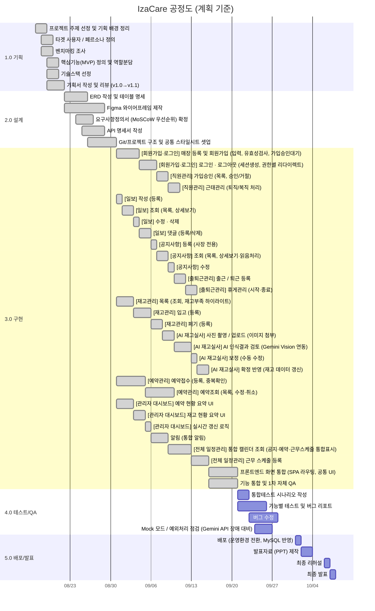

# 00. 공정도 (WBS)

> 작성: 김가현, 강경태, 서태민, 유충열, 이원준 · 작성일 2026-08-24  
> 기간: **2026-08-17 ~ 2026-10-07 (8주)** · 원본: [`original/00_공정도_WBS.xlsx`](original/00_공정도_WBS.xlsx)

## 한눈에 보기

| 단계 | 기간 | 주요 산출물 |
|---|---|---|
| **1.0 기획** | 08/17 ~ 08/21 | 기획서 초안, 페르소나 표, 벤치마킹 정리표, 역할분담표 |
| **2.0 설계** | 08/22 ~ 08/30 | ERD, 테이블 명세서, Figma 시안, 요구사항정의서, API 명세서 |
| **3.0 구현** | 08/31 ~ 09/20 | 기능별 화면 + API (인증·재고·AI 실사·예약·근태·일보·공지·대시보드), 통합 빌드 |
| **4.0 테스트/QA** | 09/21 ~ 09/27 | 테스트 시나리오, 버그 리포트, 수정 완료 빌드, 예외처리 점검표 |
| **5.0 배포/발표** | 10/01 ~ 10/07 | 배포 완료, 발표 PPT, 리허설 완료, 발표 완료 |

## 간트 차트

## 세부 일정

> 1.0~2.0은 계획대로 진행. **3.0 구현은 AI 페어프로그래밍을 활용해 대부분 계획보다 1~3일 단축**했습니다.

### 1.0 기획

| 구분 | 세부 업무 | 담당 | 계획 | 실제 | 산출물 / 비고 |
|---|---|---|---|---|---|
| 요구사항 정의 | 프로젝트 주제 선정 및 기획 배경 정리 | 전체 | 08/17~08/18 | 08/17~08/18 계획대로 완료 | 기획서 초안 |
|  | 타겟 사용자 / 페르소나 정의 | 전체 | 08/18~08/19 | 08/18~08/19 계획대로 완료 | 페르소나 표 |
|  | 벤치마킹 조사 | 전체 | 08/18~08/19 | 08/18~08/19 계획대로 완료 | 벤치마킹 정리표 |
| 기획 확정 | 핵심기능(MVP) 정의 및 역할분담 | 김가현 | 08/19~08/20 | 08/19~08/20 계획대로 완료 | 역할분담표 |
|  | 기술스택 선정 | 유충열 | 08/19~08/20 | 08/19~08/20 계획대로 완료 | 기술스택 표 |
|  | 기획서 작성 및 리뷰 (v1.0→v1.1) | 유충열/이원준 | 08/19~08/21 | 08/19~08/21 계획대로 완료 | IzaCare_기획서.docx |

### 2.0 설계

| 구분 | 세부 업무 | 담당 | 계획 | 실제 | 산출물 / 비고 |
|---|---|---|---|---|---|
| DB 설계 | ERD 작성 및 테이블 명세 | 유충열 | 08/22~08/25 | 08/22~08/25 계획대로 완료 | ERD, 테이블 명세서 |
| 화면 설계 | Figma 와이어프레임 제작 | 서태민 | 08/22~08/28 | 08/22~08/28 계획대로 완료 | Figma 시안 |
| 요구사항 / 명세 | 요구사항정의서 (MoSCoW 우선순위) 확정 | 김가현 | 08/24~08/26 | 08/24~08/26 계획대로 완료 | 요구사항정의서 |
|  | API 명세서 작성 | 강경태/유충열 | 08/25~08/28 | 08/25~08/28 계획대로 완료 | API 명세서 |
| 개발환경 | Git/프로젝트 구조 및 공통 스타일시트 셋업 | 강경태 | 08/26~08/30 | 08/26~08/30 계획대로 완료 | Git repo, 공통 CSS |

### 3.0 구현

| 구분 | 세부 업무 | 담당 | 계획 | 실제 | 산출물 / 비고 |
|---|---|---|---|---|---|
| 인증 / 직원관리 (강경태) | [회원가입·로그인] 매장 등록 및 회원가입 (입력, 유효성검사, 가입승인대기) | 강경태 | 08/31~09/03 | 08/31~09/01 AI 페어프로그래밍 활용, 계획 대비 2일 단축 완료 | 회원가입 화면 |
|  | [회원가입·로그인] 로그인 · 로그아웃 (세션생성, 권한별 리다이렉트) | 강경태 | 09/04~09/06 | 09/02~09/02 AI 페어프로그래밍 활용, 계획 대비 2일 단축 완료 | 로그인 화면 |
|  | [직원관리] 가입승인 (목록, 승인/거절) | 강경태 | 09/07~09/08 | 09/03~09/03 AI 페어프로그래밍 활용, 계획 대비 1일 단축 완료 | 직원관리 화면 |
|  | [직원관리] 근태관리 (퇴직/복직 처리) | 강경태 | 09/09~09/10 | 09/04~09/04 AI 페어프로그래밍 활용, 계획 대비 1일 단축 완료 | 직원관리 화면 |
| 일보 / 공지 / 근태 (서태민) | [일보] 작성 (등록) | 서태민 | 08/31~08/31 | 08/31~08/31 AI 활용, 계획대로 완료 | 일보 화면 |
|  | [일보] 조회 (목록, 상세보기) | 서태민 | 09/01~09/02 | 09/01~09/01 AI 페어프로그래밍 활용, 계획 대비 1일 단축 완료 | 일보 화면 |
|  | [일보] 수정 · 삭제 | 서태민 | 09/03~09/03 | 09/02~09/02 AI 활용, 계획대로 완료 | 일보 화면 |
|  | [일보] 댓글 (등록/삭제) | 서태민 | 09/04~09/05 | 09/03~09/03 AI 페어프로그래밍 활용, 계획 대비 1일 단축 완료 | 일보 화면 |
|  | [공지사항] 등록 (사장 전용) | 서태민 | 09/06~09/06 | 09/04~09/04 AI 활용, 계획대로 완료 | 공지사항 화면 |
|  | [공지사항] 조회 (목록, 상세보기·읽음처리) | 서태민 | 09/07~09/08 | 09/05~09/05 AI 페어프로그래밍 활용, 계획 대비 1일 단축 완료 | 공지사항 화면 |
|  | [공지사항] 수정 | 서태민 | 09/09~09/09 | 09/06~09/06 AI 활용, 계획대로 완료 | 공지사항 화면 |
|  | [출퇴근관리] 출근 / 퇴근 등록 | 서태민 | 09/10~09/11 | 09/07~09/07 AI 페어프로그래밍 활용, 계획 대비 1일 단축 완료 | 출퇴근 화면 |
|  | [출퇴근관리] 휴게관리 (시작·종료) | 서태민 | 09/12~09/13 | 09/08~09/08 AI 페어프로그래밍 활용, 계획 대비 1일 단축 완료 | 출퇴근 화면 |
| 재고 / AI 실사 (이원준) | [재고관리] 목록 (조회, 재고부족 하이라이트) | 이원준 | 08/31~09/02 | 08/31~08/31 AI 페어프로그래밍 활용, 계획 대비 2일 단축 완료 | 재고관리 화면 |
|  | [재고관리] 입고 (등록) | 이원준 | 09/03~09/05 | 09/01~09/01 AI 페어프로그래밍 활용, 계획 대비 2일 단축 완료 | 재고관리 화면 |
|  | [재고관리] 폐기 (등록) | 이원준 | 09/06~09/07 | 09/02~09/02 AI 페어프로그래밍 활용, 계획 대비 1일 단축 완료 | 재고관리 화면 |
|  | [AI 재고실사] 사진 촬영 / 업로드 (이미지 첨부) | 이원준 | 09/08~09/09 | 09/03~09/03 AI 페어프로그래밍 활용, 계획 대비 1일 단축 완료 | AI 실사 화면 |
|  | [AI 재고실사] AI 인식결과 검토 (Gemini Vision 연동) | 이원준 | 09/10~09/12 | 09/04~09/04 AI 페어프로그래밍 활용, 계획 대비 2일 단축 완료 | AI 실사 화면 |
|  | [AI 재고실사] 보정 (수동 수정) | 이원준 | 09/13~09/13 | 09/05~09/05 AI 활용, 계획대로 완료 | AI 실사 화면 |
|  | [AI 재고실사] 확정 반영 (재고 데이터 갱신) | 이원준 | 09/14~09/15 | 09/06~09/06 AI 페어프로그래밍 활용, 계획 대비 1일 단축 완료 | AI 실사 화면 |
| 예약 (유충열) | [예약관리] 예약접수 (등록, 중복확인) | 유충열 | 08/31~09/04 | 08/31~09/01 AI 페어프로그래밍 활용, 계획 대비 3일 단축 완료 | 예약 화면 |
|  | [예약관리] 예약조회 (목록, 수정·취소) | 유충열 | 09/05~09/09 | 09/02~09/03 AI 페어프로그래밍 활용, 계획 대비 3일 단축 완료 | 예약 화면 |
| 대시보드 / 일정 / 알림 (김가현) | [관리자 대시보드] 예약 현황 요약 UI | 김가현 | 08/31~09/02 | 08/31~08/31 AI 페어프로그래밍 활용, 계획 대비 2일 단축 완료 | 대시보드 화면 |
|  | [관리자 대시보드] 재고 현황 요약 UI | 김가현 | 09/03~09/04 | 09/01~09/01 AI 페어프로그래밍 활용, 계획 대비 1일 단축 완료 | 대시보드 화면 |
|  | [관리자 대시보드] 실시간 갱신 로직 | 김가현 | 09/05~09/05 | 09/02~09/02 AI 활용, 계획대로 완료 | 대시보드 화면 |
|  | 알림 (통합 알림) | 김가현 | 09/06~09/08 | 09/03~09/03 AI 페어프로그래밍 활용, 계획 대비 2일 단축 완료 | 알림 화면 |
|  | [전체 일정관리] 통합 캘린더 조회 (공지·예약·근무스케줄 통합표시) | 김가현 | 09/09~09/12 | 09/04~09/05 AI 페어프로그래밍 활용, 계획 대비 2일 단축 완료 | 캘린더 화면 |
|  | [전체 일정관리] 근무 스케줄 등록 | 김가현 | 09/13~09/15 | 09/06~09/06 AI 페어프로그래밍 활용, 계획 대비 2일 단축 완료 | 캘린더 화면 |
| 통합 | 프론트엔드 화면 통합 (SPA 라우팅, 공통 UI) | 김가현 | 09/16~09/20 | 09/16~09/17 AI 페어프로그래밍 활용, 계획 대비 3일 단축 완료 | 통합 화면 |
|  | 기능 통합 및 1차 자체 QA | 전체 | 09/16~09/20 | 09/16~09/17 AI 페어프로그래밍 활용, 계획 대비 3일 단축 완료 | 통합 빌드 |

### 4.0 테스트/QA

| 구분 | 세부 업무 | 담당 | 계획 | 실제 | 산출물 / 비고 |
|---|---|---|---|---|---|
| 테스트 | 통합테스트 시나리오 작성 | 이원준 | 09/21~09/22 | — | 테스트 시나리오 |
|  | 기능별 테스트 및 버그 리포트 | 전체 | 09/21~09/25 | — | 버그 리포트 |
|  | 버그 수정 | 각 담당자 | 09/23~09/27 | — | 수정 완료 빌드 |
|  | Mock 모드 / 예외처리 점검 (Gemini API 장애 대비) | 이원준 | 09/24~09/26 | — | 예외처리 점검표 |

### 5.0 배포/발표

| 구분 | 세부 업무 | 담당 | 계획 | 실제 | 산출물 / 비고 |
|---|---|---|---|---|---|
| 배포 / 발표 | 배포 (운영환경 전환, MySQL 반영) | 유충열 | 10/01~10/01 | — | 배포 완료 |
|  | 발표자료 (PPT) 제작 | 김가현 | 10/02~10/03 | — | 발표 PPT |
|  | 최종 리허설 | 전체 | 10/06~10/06 | — | 리허설 완료 |
|  | 최종 발표 | 전체 | 10/07~10/07 | — | 발표 완료 |

## 기능 / 화면 상세 분해

| 대분류 | 중분류 | 소분류 | 세분류 | 체크항목 |
|---|---|---|---|---|
| **공통 (인증)** | 회원가입 · 로그인 | 매장 등록 및 회원가입 | 입력 | 매장정보 입력 |
|  |  |  |  | 이메일/비밀번호 입력 |
|  |  |  |  | 유효성 검사 |
|  |  |  | 가입승인 대기 | 승인 전 접근 제한 안내 |
|  |  | 로그인 | 로그인 | 세션 생성 |
|  |  |  |  | 권한별(직원/사장) 리다이렉트 |
|  |  |  | 로그아웃 | 세션 종료 |
| **사장 (관리자)** | 관리자 대시보드 | 대시보드 | 조회 | 예약 현황 요약 |
|  |  |  |  | 재고 현황 요약 |
|  |  |  |  | 실시간 갱신 |
|  | 직원관리 | 가입승인 | 목록 | 승인대기 목록 |
|  |  |  |  | 페이징 |
|  |  |  | 승인 / 거절 | 승인 처리 |
|  |  |  |  | 거절 사유 입력 |
|  |  | 근태관리 | 퇴직 / 복직 처리 | 상태 변경 |
|  |  |  |  | 이력 기록 |
|  | 전체 일정관리 | 통합 캘린더 | 조회 | 공지 · 예약 · 근무스케줄 통합 표시 |
|  |  |  | 등록 | 근무 스케줄 등록 |
| **직원 (User)** | 재고관리 | 목록 | 조회 | 재고 목록 |
|  |  |  |  | 재고 부족 하이라이트 |
|  |  | 입고 | 등록 | 품목 · 수량 입력 |
|  |  |  |  | 변동 이력 기록 |
|  |  | 폐기 | 등록 | 폐기 사유 입력 |
|  |  |  |  | 변동 이력 기록 |
|  |  | AI 재고실사 | 사진 촬영 / 업로드 | 이미지 첨부 |
|  |  |  | AI 인식결과 검토 | 인식 수량 표시 |
|  |  |  | 보정 | 수동 수정 |
|  |  |  | 확정 반영 | 재고 데이터 갱신 |
|  | 예약관리 | 예약접수 | 등록 | 날짜 · 시간 · 인원 · 테이블 선택 |
|  |  |  | 중복확인 | 동일 시간대 중복예약 경고 |
|  |  | 예약조회 | 목록 | 날짜별 조회 |
|  |  |  |  | 검색 |
|  |  |  | 수정 · 취소 | 상태 변경 |
|  | 일보 (업무일지) | 작성 | 등록 | 근무 내용 입력 |
|  |  | 조회 | 목록 | 날짜별 조회 |
|  |  |  |  | 페이징 |
|  |  |  | 상세보기 | 댓글 목록 |
|  |  | 수정 · 삭제 | 수정 | 수정 |
|  |  |  | 삭제 | 삭제 |
|  |  | 댓글 | 등록 / 삭제 | 댓글 CRUD |
|  | 공지사항 | 등록 (사장 전용) | 등록 | 제목 · 내용 입력 |
|  |  | 조회 | 목록 | 페이징 |
|  |  |  | 상세보기 | 확인 체크 (읽음 처리) |
|  |  | 수정 | 수정 | 수정 |
|  | 출퇴근관리 | 출근 / 퇴근 | 출근 등록 | 출근 시간 기록 |
|  |  |  | 퇴근 등록 | 퇴근 시간 기록 |
|  |  | 휴게관리 | 휴게 시작 · 종료 | 휴게 시간 기록 |
|  | 알림 | 통합 알림 | 조회 | 재고부족 · 예약 · 공지 · 일보 알림 목록 |
|  |  |  | 읽음 처리 | 읽음 상태 갱신 |

---
[← 문서 목록](README.md) · [프로젝트 README](../README.md)
