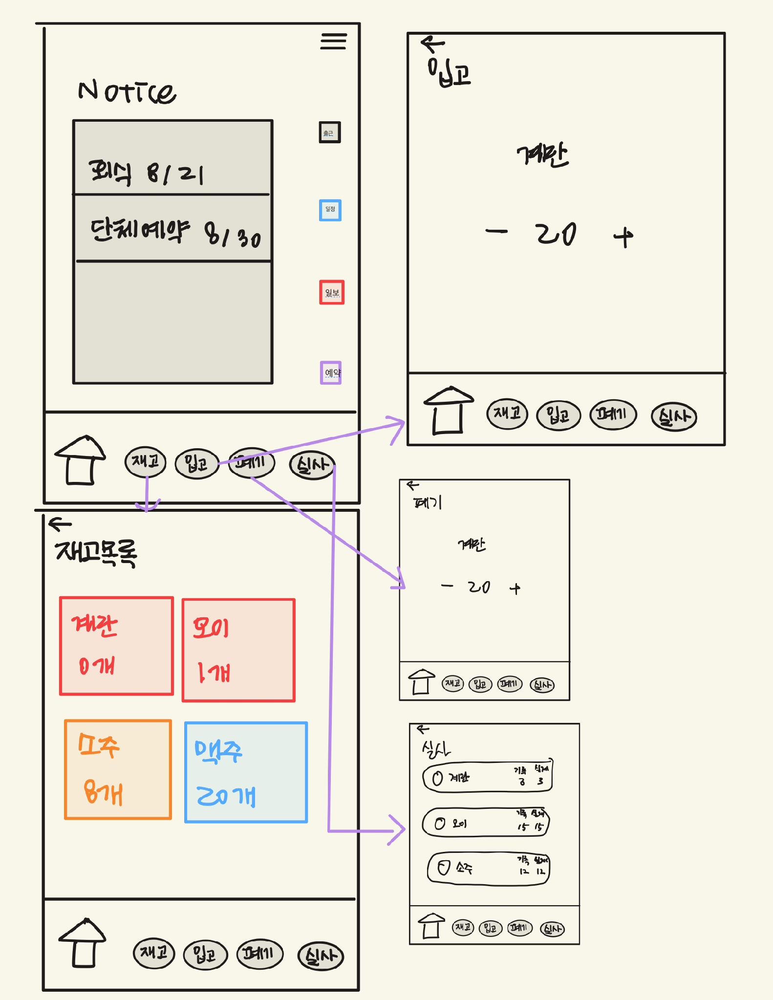
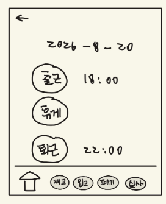
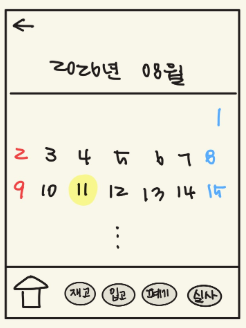
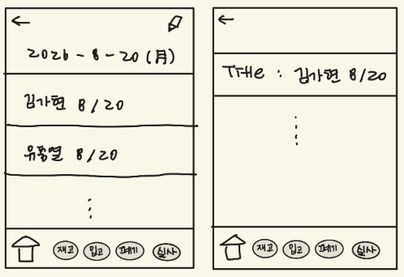
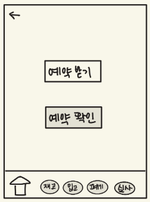
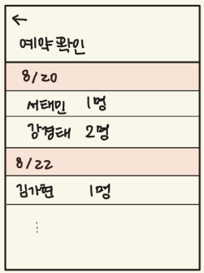
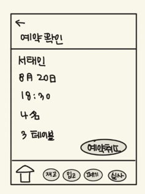
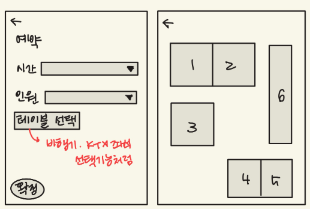

# 01. 프로젝트 기획서 (企画書)

> 원본: [`original/01_기획서.docx`](original/01_기획서.docx)

| **항목**   | **내용**                                                      |
|------------|---------------------------------------------------------------|
| 프로젝트명 | 이자카야의 예약·재고·매장 운영을 통합 관리하는 서비스 IzaCare |
| 조 / 조장  | 5조 / 김가현                                                  |
| 조원       | 강경태, 서태민, 유충열, 이원준                                |
| 작성일     | 2026-08-19                                                    |
| 버전       | 1.1                                                           |

## 1. 무엇을 만드는가 (한 문장)

> 이자카야의 사장·직원이 전화와 수기 장부로 매장을 운영하며 중복
> 예약이나 인수인계 누락이 빈번했던 상황에 대해, 예약·재고·일보·공지를
> 웹에서 실시간으로 통합 관리하고 공유할 수 있게 하는 서비스.

## 2. 왜 만드는가 (기획 배경)

본 프로젝트는 팀 리더가 도쿄에서 워킹홀리데이 중 이자카야에서
아르바이트를 한 경험을 계기로 기획되었다.

| **구분**                  | **내용**                                                                                                                                                                                                                                                                                                                                                                                                                                                        |
|---------------------------|-----------------------------------------------------------------------------------------------------------------------------------------------------------------------------------------------------------------------------------------------------------------------------------------------------------------------------------------------------------------------------------------------------------------------------------------------------------------|
| 현재의 문제               | 전화와 수기 장부로 예약을 받다 보니, 동일 시간대에 예약이 중복되거나 급하게 접수된 예약 내용이 제대로 기록되지 않아 손님에게 안내되지 못하는 상황이 여러 차례 있었다. 또한 재고 역시 수기로 확인·기록하다 보니, 특정 재료가 소진된 것을 뒤늦게 파악해 주문을 받고도 조리하지 못하는 상황이 발생했다.                                                                                                                                                            |
| 기존 방식의 한계          | 교대 근무 특성상 이전 근무자가 파악한 예약 현황이나 재고 상태가 다음 근무자에게 제대로 인수인계되지 않아 직원들 사이에서 혼선이 빚어지고, 이를 재확인하느라 불필요한 시간과 에너지가 소모되었다. 특히 재고는 근무자마다 확인하는 기준이나 기록 방식이 달라, 같은 재료를 두고도 "있다"와 "없다"는 상반된 답이 나오는 경우도 있었다. 기존 POS·키오스크는 결제와 주문 처리에 특화되어 있어, 예약·재고·교대 인수인계를 하나로 묶어 관리하는 도구는 여전히 부족하다. |
| 우리 서비스가 해결하는 것 | 예약·재고 정보를 하나의 시스템으로 통합하고, 일보·공지·알림을 통해 교대 근무자 간 정보가 자동으로 인계되도록 하여, 관리자와 직원이 실시간으로 정확한 정보를 공유할 수 있게 한다.                                                                                                                                                                                                                                                                                |
| 이 서비스를 안 만들면?    | 사장은 매장 현황을 실시간으로 파악할 수 없고, 직원은 항상 실수에 대한 불안을 안은 채 일할 수밖에 없다. 예약 중복이나 정보 전달 실수로 인한 손님 응대 지연도 계속 발생한다.                                                                                                                                                                                                                                                                                      |

## 3. 누가 쓰는가 (타겟 사용자 · 페르소나)

| **사용자 유형** | **설명**                                            | **주요 목적**                                                                                                                                                                         |
|-----------------|-----------------------------------------------------|---------------------------------------------------------------------------------------------------------------------------------------------------------------------------------------|
| 직원            | 매장에서 접객·예약 접수·재고 관리를 담당하는 스태프 | 전화로 받은 예약을 등록하고 예약 현황을 확인하며, 입고·폐기 등 재고 변동을 기록한다. AI 실사로 재고를 점검하고, 일보를 작성해 근무 내용을 공유하며, 공지를 확인하고 출퇴근을 기록한다 |
| 사장(관리자)    | 매장을 등록하고 해당 매장의 운영을 총괄하는 책임자  | 예약·재고 현황을 실시간으로 파악하고, 공지·근무 스케줄을 등록해 팀에 전달한다. 직원의 가입 승인과 근태를 관리하며, 재고 변동 이력과 실사 결과를 확인한다                              |

## 4. 핵심 기능 (MVP)

### 4-1. MVP 기능

| **No** | **기능명**                  | **설명**                                           | **담당** |
|--------|-----------------------------|----------------------------------------------------|----------|
| 1      | 회원가입·로그인 (권한 관리) | 매장 등록 및 가입, 직원/사장 2단계 권한, 가입 승인 | 강경태   |
| 2      | 직원 관리                   | 가입 승인·거절, 퇴직·복직 처리                     | 강경태   |
| 3      | 일보(업무일지)              | 일보 작성·조회·수정, 댓글                          | 서태민   |
| 4      | 공지사항                    | 공지 등록·조회·수정, 확인 체크                     | 서태민   |
| 5      | 출퇴근                      | 출근, 퇴근, 휴게 관리                              | 서태민   |
| 6      | 재고 관리                   | 입고, 폐기, 변동 이력                              | 이원준   |
| 7      | AI 재고 실사                | 사진 인식 → 검토·보정 → 확정 반영                  | 이원준   |
| 8      | 관리자 대시보드             | 예약·재고 현황을 실시간으로 한눈에 표시            | 김가현   |
| 9      | 전체 일정 관리              | 공지·예약·근무 스케줄 통합 달력                    | 김가현   |
| 10     | 알림                        | 재고 부족·예약·공지·일보 등 통합 알림              | 김가현   |
| 11     | 예약 접수                   | 날짜·시간·인원·테이블을 지정해 예약                | 유충열   |

### 4-2. 추가 기능 (시간이 남으면)

| **No** | **기능명**     | **설명**                             | **담당** |
|--------|----------------|--------------------------------------|----------|
| 1      | 매출·재고 통계 | 일별·월별 집계 및 시각화             | 미정     |
| 2      | 발주 자동 제안 | 재고 부족 품목 기반 발주 리스트 생성 | 미정     |

## 5. 화면 구성 (개요)

> 기획 단계의 손그림 스케치입니다. 확정 화면은 [03. 화면 설계서](03-화면설계서.md)를 참고하세요.

| 5-1 메인 · 재고 관리 | 5-2 출퇴근 관리 | 5-3 일정 관리 |
|:-:|:-:|:-:|
|  |  |  |

| 5-4 일보 게시판 |
|:-:|
|  |

**5-5 예약**

| | | |
|:-:|:-:|:-:|
|  |  |  |

## 6. 기술 스택

| 구분        | 선택 기술                                 | 선택 이유                                                                                                                                                                             |
|-------------|-------------------------------------------|---------------------------------------------------------------------------------------------------------------------------------------------------------------------------------------|
| Language    | Java 21                                   | LTS 버전으로 안정성이 확보되어 있으며, Spring Boot 3.x 계열과 호환성이 높음                                                                                                           |
| Framework   | Spring Boot 3.3.5                         | 트랜잭션 처리와 계층 구조가 표준화되어 있어, 재고 변동·예약 상태 관리 등 데이터 정합성이 중요한 로직 구현에 적합                                                                      |
| 데이터 접근 | Spring Data JPA                           | 엔티티 간 관계(회원·재고·예약·알림)가 명확하고 CRUD 비중이 높음. DB 종류에 의존하지 않아 개발용 H2에서 운영용 MySQL로 전환 시 코드 수정이 불필요                                      |
| DB          | MySQL 8.0 (개발 단계 H2)                  | 과정 표준. 개발 초기에는 설정 부담이 적은 H2 인메모리를 사용하고, 데이터 영속성이 필요한 시점에 MySQL로 전환                                                                          |
| View        | 단일 HTML SPA (해시 라우팅)               | 매장 직원이 근무 중 모바일로 사용하는 시나리오를 고려해, 페이지 전환 없이 하단 고정 내비게이션으로 이동하는 구조를 채택. 별도 빌드 도구(npm 등) 없이 프론트엔드 미경험 팀도 구현 가능 |
| 인증·권한   | HttpSession + BCrypt + HandlerInterceptor | 직원/사장 2단계 권한 구조가 단순해 프레임워크 도입 없이 인터셉터로 구현. 화면 제어와 별개로 서버에서 차단하여 API 직접 호출 우회를 방지                             |
| 외부 AI     | Google Gemini (Vision)                    | 재고 실사 자동화를 위한 이미지 인식. 인터페이스를 분리해 다른 Vision API로 교체 가능하도록 설계                                                                                       |
| 기타        | Lombok                                    | 보일러플레이트 코드 감소                                                                                                                                                              |

## 7. 역할 분담

| **이름** | **주 담당**                        | **부 담당**                | **비고** |
|----------|------------------------------------|----------------------------|----------|
| 김가현   | 관리자 대시보드, 일정              | 팀 일정 관리 (공정도 관리) |          |
| 강경태   | 인증(로그인·권한), 직원 관리, 알림 | Git 관리                   |          |
| 서태민   | 일보, 공지사항, 출퇴근             | Figma 담당 (화면 설계)     |          |
| 유충열   | 예약                               | DB 담당                    |          |
| 이원준   | 재고, AI 실사                      | 테스트 관리                |          |

## 8. 벤치마킹 / 참고

| **서비스·자료**    | **URL**                               | **참고한 점**                                                                                                      |
|--------------------|---------------------------------------|--------------------------------------------------------------------------------------------------------------------|
| Tabelog (타베로그) | https://tabelog.com/kr/               | 날짜·시간·인원 수를 선택해 예약하는 UI 구조, 이자카야 등 업종별 필터링 방식 → 예약 접수 화면 설계에 참고           |
| 월드잡플러스       | https://m.www.worldjob.or.kr/index.do | 소속 기관(학원)별로 사용자를 구분하고 각자 출석을 기록하는 구조 → 매장 단위로 직원과 데이터를 분리하는 설계에 참고 |

## 9. 예상 리스크

| 리스크                                                                                                                | 영향 | 대응                                                                                                                      |
|-----------------------------------------------------------------------------------------------------------------------|------|---------------------------------------------------------------------------------------------------------------------------|
| AI 인식 정확도 한계 — 겹쳐 쌓인 병이나 가려진 재료는 Vision AI도 정확히 셀 수 없어, 실사 결과를 그대로 신뢰할 수 없음 | 상   | AI 결과를 확정값이 아닌 제안값으로 두고, 사용자가 검토·보정한 뒤 확정하는 4단계 구조로 설계. 최종 책임은 사람에게 유지    |
| 외부 API 의존 — Gemini API 장애·요금 정책 변경·키 미발급 시 실사 기능 전체가 중단됨                                   | 중   | Vision 클라이언트를 인터페이스로 추상화해 교체 가능하도록 설계. API 키가 없을 때는 Mock 모드로 동작해 전체 흐름 시연 가능 |
| 프론트엔드 미경험 — 팀 전원이 프론트엔드 경험이 없어 화면 구현에서 일정이 지연될 수 있음                              | 중   | 빌드 도구 없이 단일 HTML SPA 구조를 채택. 공용 스타일시트를 먼저 정의해 화면별 구현 편차를 줄임                           |
| 기능 범위 확대 — 개발 중 기능이 계속 추가되어 MVP 완성 전에 일정이 부족해질 수 있음                                   | 상   | 요구사항 정의서에서 MoSCoW로 우선순위를 명확히 구분하고, Must 기능 완성 전까지 Should 이하 착수를 보류                    |
| API 키 노출 — 외부 AI 키가 소스코드나 로그에 포함된 채 커밋될 위험                                                    | 중   | 키를 별도 설정 파일로 분리하고 .gitignore에 등록. API 호출 시 URL 파라미터가 아닌 헤더 방식으로 전달해 로그 유출 방지     |

## 10. 변경 이력

| **버전** | **일자**   | **작성** | **변경 내용**                                                                                                    |
|----------|------------|----------|------------------------------------------------------------------------------------------------------------------|
| 1.0      | 2026-08-19 | 유충열   | 최초 작성                                                                                                        |
| 1.1      | 2026-08-21 | 유충열   | 이원준 작성 프로토타입 검증 결과 반영 — 기능 범위 확대(공지·알림·AI 실사 등), 기술 스택 정정, 예상 리스크 재작성 |

---
[← 문서 목록](README.md) · [프로젝트 README](../README.md)
