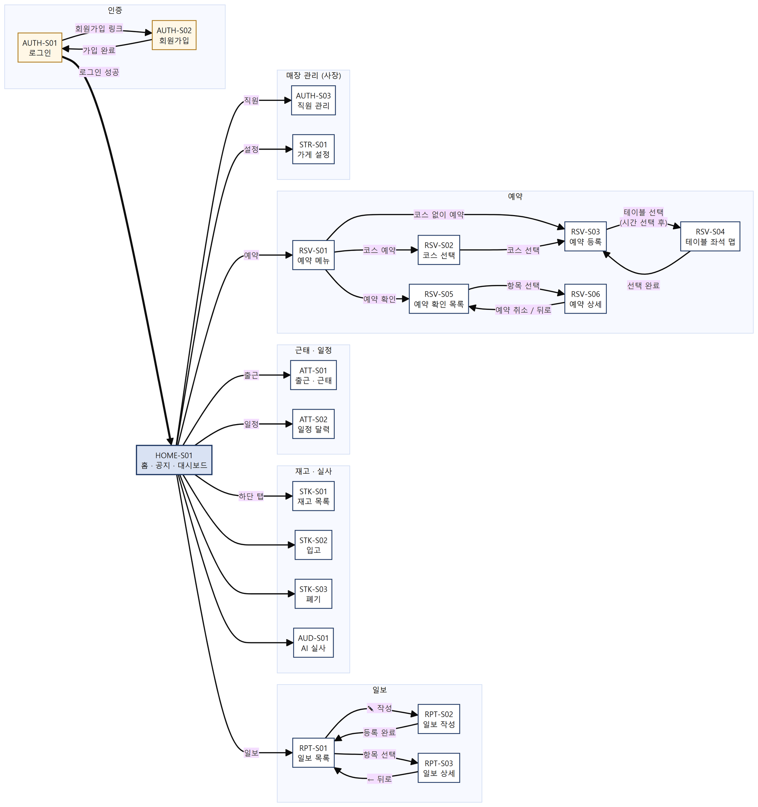
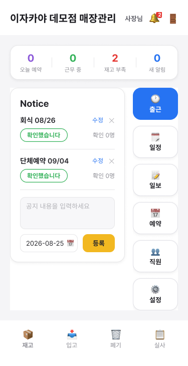
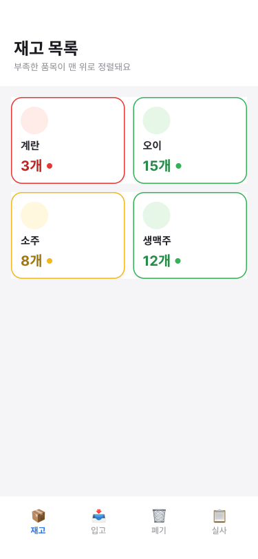
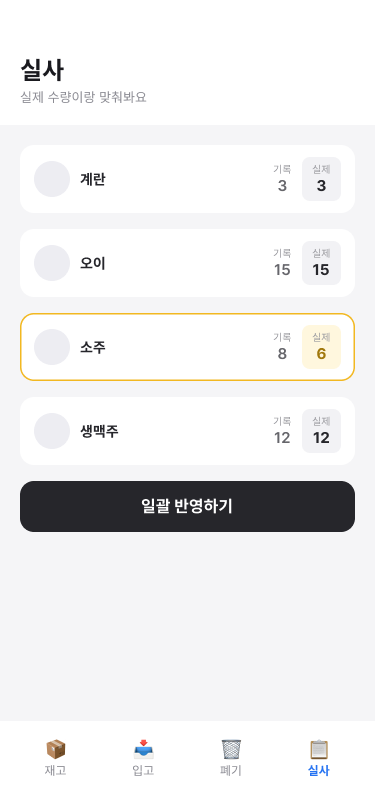
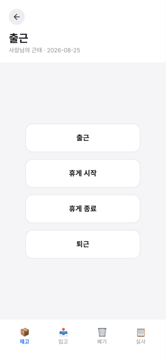
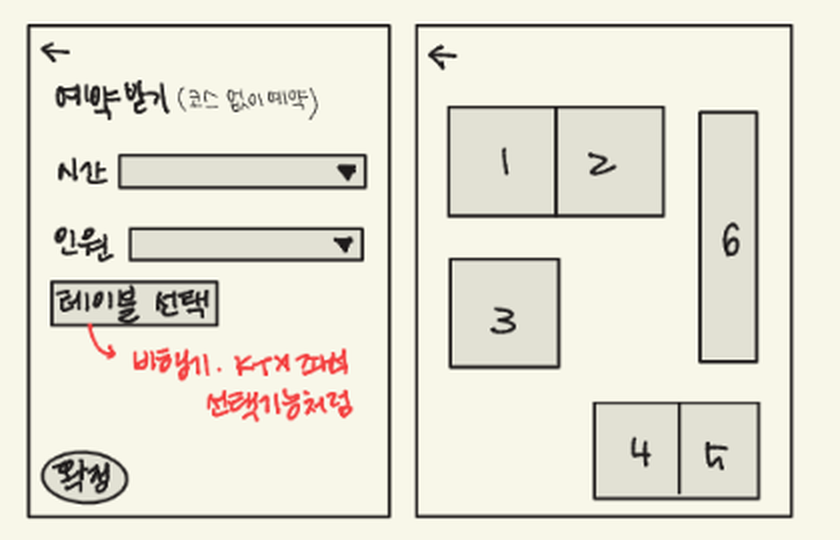
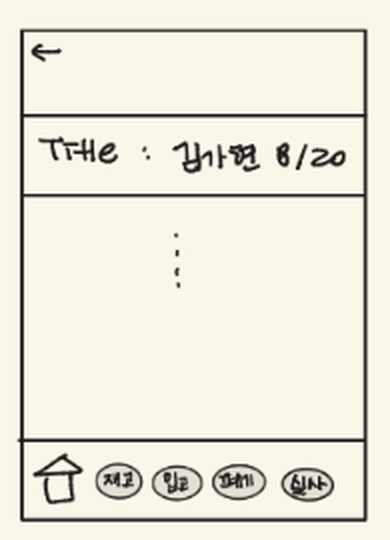

# 03. 화면 설계서 (画面設計書)

> 원본: [`original/03_화면설계서.docx`](original/03_화면설계서.docx)

| **항목**         | **내용**                               |
|------------------|----------------------------------------|
| 프로젝트명       | IzaCare                                |
| 작성자           | 김가현, 강경태, 서태민, 이원준, 유충열 |
| **화면 방식**    | **REST API + 정적 프런트엔드**         |
| 사용한 설계 도구 | GoodNotes, Figma                       |

> **이 프로젝트는 B 트랙(REST API + 정적 프런트엔드)이다. Thymeleaf
> 트랙(3-A)은 삭제했다. 와이어프레임은 GoodNotes 손그림과 Figma 시안을
> 쓰고, 원본은 docs/images/ 에 함께 보관한다.**

## 목차

1. [화면 흐름도](#1-화면-흐름도-画面遷移図--공통)
2. [화면 목록](#2-화면-목록--공통)
3. [서버 처리 설계 · REST API 명세](#3-서버-처리-설계)
4. [화면 상세 설계](#4-화면-상세-설계) — [HOME-S01](#home-s01-홈--공지--대시보드) · [STK-S01](#stk-s01-재고-목록) · [AUD-S01](#aud-s01-ai-실사) · [ATT-S01](#att-s01-출근--근태) · [RSV-S03](#rsv-s03-예약-등록--rsv-s04-테이블-좌석-맵) · [RPT-S03](#rpt-s03-일보-상세)
5. [공통 UI 규칙](#5-공통-ui-규칙)

## 1. 화면 흐름도 (画面遷移図) — 공통



*▼ 화면 전이표 — index.html 의 화면 이동 코드에서 추출했다. 조건부
이동과 실패 시 동작을 포함한다.*

| **출발 화면**                                                  | **사용자 동작 · 조건**                                   | **도착 화면**                                                                                              |
|----------------------------------------------------------------|----------------------------------------------------------|------------------------------------------------------------------------------------------------------------|
| (모든 화면)                                                    | 로그인하지 않은 상태로 접근                              | AUTH-S01 로그인                                                                                            |
| AUTH-S01 로그인                                                | '회원가입' 링크                                          | AUTH-S02 회원가입                                                                                          |
| AUTH-S01 로그인                                                | 아이디·비밀번호 입력 후 로그인 성공                      | HOME-S01 홈                                                                                                |
| AUTH-S01 로그인                                                | 승인 대기·거절·퇴직 계정 — 안내만 표시하고 이동하지 않음 | AUTH-S01 로그인                                                                                            |
| AUTH-S02 회원가입                                              | 사장 가입 완료 → 가게 코드 안내 후 '로그인하러 가기'     | AUTH-S01 로그인                                                                                            |
| AUTH-S02 회원가입                                              | 직원 가입 완료 (승인 대기 상태로 저장)                   | AUTH-S01 로그인                                                                                            |
| (모든 화면)                                                    | 로그인한 상태로 로그인·회원가입 화면에 접근              | HOME-S01 홈                                                                                                |
| (모든 화면)                                                    | 로그아웃                                                 | AUTH-S01 로그인                                                                                            |
| (모든 화면)                                                    | 세션 만료 — API 가 401 을 반환                           | AUTH-S01 로그인                                                                                            |
| (모든 화면)                                                    | 하단 탭 '홈'                                             | HOME-S01 홈                                                                                                |
| (모든 화면)                                                    | 하단 탭 '입고'                                           | STK-S02 입고                                                                                               |
| (모든 화면)                                                    | 하단 탭 '재고'                                           | STK-S01 재고 목록                                                                                          |
| (모든 화면)                                                    | 하단 탭 '폐기'                                           | STK-S03 폐기                                                                                               |
| (모든 화면)                                                    | 하단 탭 '실사'                                           | AUD-S01 AI 실사                                                                                            |
| HOME-S01 홈                                                    | '출근' 버튼                                              | ATT-S01 출근 · 근태                                                                                        |
| HOME-S01 홈                                                    | '일정' 버튼                                              | ATT-S02 일정 달력                                                                                          |
| HOME-S01 홈                                                    | '일보' 버튼                                              | RPT-S01 일보 목록                                                                                          |
| HOME-S01 홈                                                    | '예약' 버튼                                              | RSV-S01 예약 메뉴                                                                                          |
| HOME-S01 홈                                                    | '직원' 버튼 — 사장에게만 표시                            | AUTH-S03 직원 관리                                                                                         |
| HOME-S01 홈                                                    | '설정' 버튼 — 사장에게만 표시                            | STR-S01 가게 설정                                                                                          |
| HOME-S01 홈                                                    | 알림(🔔) 항목 선택 — 알림 종류에 따라 분기               | 새 예약→RSV-S05 / 스케줄→ATT-S02 / 가입·직원→AUTH-S03 / 새 일보→RPT-S01 / 폐기→STK-S01 / 재고 부족→STK-S02 |
| HOME-S01 홈                                                    | 대시보드 항목 선택 — 사장에게만 표시                     | 오늘 예약→RSV-S06 / 부족 품목→STK-S02 / 근무 중→AUTH-S03                                                   |
| RPT-S01 일보 목록                                              | '✎ 작성' 버튼                                            | RPT-S02 일보 작성                                                                                          |
| RPT-S02 일보 작성                                              | 등록 완료                                                | RPT-S01 일보 목록                                                                                          |
| RPT-S02 일보 작성                                              | 내용이 비어 있음 — 안내만 표시하고 이동하지 않음         | RPT-S02 일보 작성                                                                                          |
| RPT-S01 일보 목록                                              | 일보 항목 선택                                           | RPT-S03 일보 상세                                                                                          |
| RPT-S03 일보 상세                                              | ← 뒤로                                                   | RPT-S01 일보 목록                                                                                          |
| RSV-S01 예약 메뉴                                              | '코스 예약'                                              | RSV-S02 코스 선택                                                                                          |
| RSV-S01 예약 메뉴                                              | '코스 없이 예약'                                         | RSV-S03 예약 등록                                                                                          |
| RSV-S01 예약 메뉴                                              | '예약 확인'                                              | RSV-S05 예약 확인 목록                                                                                     |
| RSV-S02 코스 선택                                              | 코스 선택                                                | RSV-S03 예약 등록                                                                                          |
| RSV-S03 예약 등록                                              | '테이블 선택' — 시간을 선택한 경우                       | RSV-S04 테이블 좌석 맵                                                                                     |
| RSV-S03 예약 등록                                              | '테이블 선택' — 시간 미선택 — 안내만 표시                | RSV-S03 예약 등록                                                                                          |
| RSV-S04 테이블 좌석 맵                                         | '선택 완료'                                              | RSV-S03 예약 등록                                                                                          |
| RSV-S04 테이블 좌석 맵                                         | 시간 정보가 없는 상태로 진입 — 자동 복귀                 | RSV-S03 예약 등록                                                                                          |
| RSV-S05 예약 확인 목록                                         | 예약 항목 선택                                           | RSV-S06 예약 상세                                                                                          |
| RSV-S06 예약 상세                                              | 예약 취소 (확인창 승인)                                  | RSV-S05 예약 확인 목록                                                                                     |
| RSV-S06 예약 상세                                              | ← 뒤로                                                   | RSV-S05 예약 확인 목록                                                                                     |
| 재고·실사·근태·일정·일보 목록·예약 메뉴·직원 관리·가게 설정    | 상단 ← 뒤로                                              | HOME-S01 홈                                                                                                |
| RSV-S02 코스 선택 · RSV-S05 예약 확인 목록 · RSV-S03 예약 등록 | 상단 ← 뒤로                                              | RSV-S01 예약 메뉴                                                                                          |

## 2. 화면 목록 — 공통

| **화면 ID** | **화면명**         | **화면 경로**      | **접근 권한** | **관련 요구사항 ID**                     | **담당**        |
|-------------|--------------------|--------------------|---------------|------------------------------------------|-----------------|
| AUTH-S01    | 로그인             | \#login            | 미로그인      | AUTH-03, AUTH-05                         | 강경태          |
| AUTH-S02    | 회원가입           | \#signup           | 미로그인      | AUTH-01, AUTH-02, STR-01, STR-02         | 강경태          |
| AUTH-S03    | 직원 관리          | \#staff            | 사장          | AUTH-07, AUTH-08, AUTH-09, AUTH-10       | 강경태          |
| HOME-S01    | 홈 (공지·대시보드) | \#home             | 전체          | NTC-01~07, DSH-01~03, ALM-01~05, AUTH-04 | 서태민 · 김가현 |
| STK-S01     | 재고 목록          | \#stock            | 전체          | STK-02, STK-06, STK-07                   | 이원준          |
| STK-S02     | 입고               | \#inbound          | 전체          | STK-01, STK-03                           | 이원준          |
| STK-S03     | 폐기               | \#dispose          | 전체          | STK-04                                   | 이원준          |
| AUD-S01     | AI 실사            | \#audit            | 전체          | AUD-01~09                                | 이원준          |
| ATT-S01     | 출근 · 근태        | \#attendance       | 전체          | ATT-01~05                                | 서태민          |
| ATT-S02     | 일정 달력          | \#calendar         | 전체          | ATT-06, ATT-07, NTC-02, RSV-09           | 김가현          |
| RPT-S01     | 일보 목록          | \#reports          | 전체          | RPT-03                                   | 서태민          |
| RPT-S02     | 일보 작성          | \#report-new       | 전체          | RPT-01, RPT-02                           | 서태민          |
| RPT-S03     | 일보 상세          | \#report/{id}      | 전체          | RPT-03, RPT-04, RPT-05, RPT-06, RPT-07   | 서태민          |
| RSV-S01     | 예약 메뉴          | \#reserve          | 전체          | RSV-01                                   | 유충열          |
| RSV-S02     | 코스 선택          | \#course-list      | 전체          | RSV-01, STR-06                           | 유충열          |
| RSV-S03     | 예약 등록          | \#reserve-new      | 전체          | RSV-02, RSV-04, RSV-07, RSV-11           | 유충열          |
| RSV-S04     | 테이블 좌석 맵     | \#tables           | 전체          | RSV-03, RSV-04, RSV-05, RSV-06           | 유충열          |
| RSV-S05     | 예약 확인 목록     | \#reserve-list     | 전체          | RSV-09                                   | 유충열          |
| RSV-S06     | 예약 상세          | \#reservation/{id} | 전체          | RSV-07, RSV-10, RSV-11                   | 유충열          |
| STR-S01     | 가게 설정          | \#settings         | 사장          | STR-02, STR-03, STR-04, STR-06, STR-07   | 강경태 · 유충열 |

## 3. 서버 처리 설계

### 3-0. URL 설계 원칙 — 공통

| **원칙**                                                  | **좋은 예**        | **나쁜 예**                 |
|-----------------------------------------------------------|--------------------|-----------------------------|
| 자원은 **명사 복수형**                                    | /books             | /getBookList, /bookListPage |
| 계층은 경로로 표현                                        | /books/1/reviews   | /reviewList?bookId=1        |
| 소문자 + 하이픈                                           | /rental-histories  | /rentalHistories            |
| 조회는 GET, **데이터를 바꾸면 \`POST\`(또는 PUT/DELETE)** | POST /books/1/rent | GET /books/1/rent           |

> ⚠️ **데이터를 변경하는 동작을 \`GET\`으로 만들지 않습니다.** 주소창에
> URL을 입력하는 것만으로 데이터가 바뀝니다.

### 3-1. REST API 명세

#### 공통 규칙

| **항목**  | **규칙**                                                                               |
|-----------|----------------------------------------------------------------------------------------|
| Base URL  | http://localhost:8080                                                                  |
| 형식      | Content-Type: application/json; charset=UTF-8 (실사 사진 업로드만 multipart/form-data) |
| 인증      | 세션 쿠키 JSESSIONID (HttpOnly). 로그인이 필요한 API는 인증 열에 '로그인' 또는 '사장'  |
| 날짜 형식 | 날짜 YYYY-MM-DD / 시각 HH:mm:ss / 일시 YYYY-MM-DDTHH:mm:ss                             |
| 페이징    | 사용하지 않는다 — 목록은 전체 또는 최근 N건(예: 변동 이력 50건)을 고정 반환            |
| 네이밍    | DB는 snake_case, JSON은 camelCase                                                      |

#### 공통 응답 형식

**성공**

```json
{ "id": 12, "name": "생맥주", "quantity": 20, "unit": "병", "lowStock": false }
```

**실패**

```json
{ "error": "재고보다 많은 수량을 차감할 수 없습니다. (현재: 3, 요청: 5)" }
```

성공 응답은 감싸는 껍데기 없이 DTO 를 그대로 내려보낸다. 실패는 error
> 한 필드만 두며, 값은 화면에 그대로 띄울 수 있는 한국어 문장으로
> 작성한다.

#### HTTP 상태 코드

| **코드** | **의미**              | **사용 상황**                                                                                               |
|----------|-----------------------|-------------------------------------------------------------------------------------------------------------|
| 200      | OK                    | 조회·수정 성공                                                                                              |
| 201      | Created               | 생성 성공 — 회원가입, 품목 등록, 예약 등록, 일보·댓글 작성, 테이블·코스 추가                                |
| 204      | No Content            | 사용하지 않음 — 삭제 API(공지·예약·댓글·스케줄)는 본문 없는 200 을 반환한다 |
| 400      | Bad Request           | 입력값 검증 실패, 존재하지 않는 리소스 ID, 보유량을 넘는 폐기                                               |
| 401      | Unauthorized          | 미로그인·세션 만료·비활성 계정 — 인터셉터가 /api/\*\* 전체에서 차단                                         |
| 403      | Forbidden             | 직원이 사장 전용 기능에 접근. 단 공지 수정, 근태 기록 조회·수정, 근무 스케줄 등록·삭제, 가게 설정은 예외 처리 경로가 달라 409 를 반환한다. |
| 409      | Conflict              | 지금 상태에서는 불가능한 요청 — 중복 출근, 사용중 테이블 예약, 이미 처리된 실사                             |
| 500      | Internal Server Error | 서버 오류 (의도적으로 내지 않는다)                                                                          |

> ⚠️ 모든 응답을 200으로 내려보내고 body의 success로만 구분하지
> 않습니다. **상태 코드로 먼저 구분**합니다.

#### 에러 코드 목록

| **발생 상황**                  | **HTTP** | **응답 메시지**                                                  |
|--------------------------------|----------|------------------------------------------------------------------|
| 보유량을 넘는 폐기             | 400      | 재고보다 많은 수량을 차감할 수 없습니다. (현재: 3, 요청: 5)      |
| 품목명 중복                    | 400      | 이미 등록된 품목입니다: 생맥주                                   |
| 없는 가게 코드로 가입          | 400      | 존재하지 않는 가게 코드입니다.                                   |
| 미로그인·세션 만료             | 401      | 로그인이 필요합니다.                                             |
| 직원이 사장 전용 기능 접근     | 403      | 사장님만 사용할 수 있는 기능입니다.                              |
| 출근 중복 기록                 | 409      | 이미 출근을 찍었습니다.                                          |
| 사용중 테이블 예약             | 409      | 3번 테이블은 사용중입니다. 공석 처리 후 다시 배정할 수 있습니다. |
| 동시 요청으로 유니크 제약 위반 | 409      | 이미 처리된 요청입니다. 화면을 새로고침해 주세요.                |

예외는 @RestControllerAdvice +
@ExceptionHandler(GlobalExceptionHandler)로 한 곳에서 처리한다. 별도의
에러 코드 체계는 두지 않고 HTTP 상태 코드와 한국어 메시지로만 구분한다.
존재하지 않는 리소스도 404 가 아니라 400 으로 응답한다.

#### API 목록

| **No** | **기능**                   | **메서드** | **URL**                              | **인증**                          | **관련 화면**     | **담당** |
|--------|----------------------------|------------|--------------------------------------|-----------------------------------|-------------------|----------|
| 1      | 회원가입 (사장·직원)       | POST       | /api/auth/signup                     | 미인증                            | AUTH-S02          | 강경태   |
| 2      | 로그인                     | POST       | /api/auth/login                      | 미인증                            | AUTH-S01          | 강경태   |
| 3      | 로그아웃                   | POST       | /api/auth/logout                     | 로그인                            | 공통              | 강경태   |
| 4      | 세션 확인 (내 정보)        | GET        | /api/auth/me                         | 미인증 허용 · 미로그인 시 401     | 공통              | 강경태   |
| 5      | 직원 목록 조회             | GET        | /api/admin/members                   | 사장                              | AUTH-S03          | 강경태   |
| 6      | 가입 승인                  | POST       | /api/admin/members/{id}/approve      | 사장                              | AUTH-S03          | 강경태   |
| 7      | 가입 거절                  | POST       | /api/admin/members/{id}/reject       | 사장                              | AUTH-S03          | 강경태   |
| 8      | 퇴직 처리                  | POST       | /api/admin/members/{id}/resign       | 사장                              | AUTH-S03          | 강경태   |
| 9      | 복직 처리                  | POST       | /api/admin/members/{id}/reinstate    | 사장                              | AUTH-S03          | 강경태   |
| 10     | 재고 목록 조회             | GET        | /api/items                           | 로그인                            | STK-S01           | 이원준   |
| 11     | 품목 단건 조회             | GET        | /api/items/{id}                      | 로그인                            | (화면 미사용)     | 이원준   |
| 12     | 품목 등록                  | POST       | /api/items                           | 로그인                            | STK-S02           | 이원준   |
| 13     | 수량 · 최소 재고 수정      | PATCH      | /api/items/{id}/quantity             | 로그인                            | STK-S01           | 이원준   |
| 14     | 입고 처리                  | POST       | /api/inbound                         | 로그인                            | STK-S02           | 이원준   |
| 15     | 폐기 처리                  | POST       | /api/dispose                         | 로그인                            | STK-S03           | 이원준   |
| 16     | 품목별 변동 이력           | GET        | /api/items/{id}/transactions         | 로그인                            | (화면 없음)       | 이원준   |
| 17     | 전체 변동 이력 (최근 50건) | GET        | /api/transactions                    | 로그인                            | (화면 없음)       | 이원준   |
| 18     | 사진 업로드 · AI 인식      | POST       | /api/audits/scan                     | 로그인                            | AUD-S01           | 이원준   |
| 19     | 실사 사진 조회             | GET        | /api/audits/{id}/images/{index}      | 로그인                            | AUD-S01           | 이원준   |
| 20     | 실사 라인 수량 보정        | PATCH      | /api/audits/{auditId}/lines/{lineId} | 로그인                            | AUD-S01           | 이원준   |
| 21     | 실사 확정                  | POST       | /api/audits/{id}/confirm             | 로그인                            | AUD-S01           | 이원준   |
| 22     | 실사 취소                  | POST       | /api/audits/{id}/cancel              | 로그인                            | AUD-S01           | 이원준   |
| 23     | 최근 실사 목록             | GET        | /api/audits                          | 로그인                            | (화면 미사용)     | 이원준   |
| 24     | 실사 단건 조회             | GET        | /api/audits/{id}                     | 로그인                            | (화면 미사용)     | 이원준   |
| 25     | 공지 목록 조회             | GET        | /api/notices                         | 로그인                            | HOME-S01          | 서태민   |
| 26     | 공지 등록                  | POST       | /api/notices                         | 사장                              | HOME-S01          | 서태민   |
| 27     | 공지 수정                  | PATCH      | /api/notices/{id}                    | 사장                              | HOME-S01          | 서태민   |
| 28     | 공지 삭제                  | DELETE     | /api/notices/{id}                    | 사장                              | HOME-S01          | 서태민   |
| 29     | 공지 수정 이력             | GET        | /api/notices/{id}/history            | 로그인                            | HOME-S01          | 서태민   |
| 30     | 공지 확인 체크             | POST       | /api/notices/{id}/ack                | 로그인                            | HOME-S01          | 서태민   |
| 31     | 당일 근태 조회             | GET        | /api/attendance/today                | 로그인                            | ATT-S01           | 서태민   |
| 32     | 출근 · 휴게 · 퇴근 기록    | POST       | /api/attendance/clock                | 로그인                            | ATT-S01           | 서태민   |
| 33     | 일보 목록 조회             | GET        | /api/reports                         | 로그인                            | RPT-S01           | 서태민   |
| 34     | 일보 상세 조회             | GET        | /api/reports/{id}                    | 로그인                            | RPT-S03           | 서태민   |
| 35     | 일보 작성                  | POST       | /api/reports                         | 로그인                            | RPT-S02           | 서태민   |
| 36     | 일보 수정                  | PATCH      | /api/reports/{id}                    | 작성자 본인 또는 사장             | RPT-S03           | 서태민   |
| 37     | 일보 수정 이력             | GET        | /api/reports/{id}/history            | 로그인                            | RPT-S03           | 서태민   |
| 38     | 댓글 목록 조회             | GET        | /api/reports/{id}/comments           | 로그인                            | RPT-S03           | 서태민   |
| 39     | 댓글 작성                  | POST       | /api/reports/{id}/comments           | 로그인                            | RPT-S03           | 서태민   |
| 40     | 댓글 수정                  | PATCH      | /api/comments/{id}                   | 작성자 본인 또는 사장             | RPT-S03           | 서태민   |
| 41     | 댓글 삭제                  | DELETE     | /api/comments/{id}                   | 작성자 본인 또는 사장             | RPT-S03           | 서태민   |
| 42     | 댓글 수정 이력             | GET        | /api/comments/{id}/history           | 로그인                            | RPT-S03           | 서태민   |
| 43     | 좌석(테이블) 현황 조회     | GET        | /api/tables?date=&timeSlot=          | 로그인                            | RSV-S04           | 유충열   |
| 44     | 날짜별 예약 조회           | GET        | /api/reservations?date=              | 로그인                            | RSV-S03           | 유충열   |
| 45     | 예약 확인 목록 (오늘 이후) | GET        | /api/reservations/upcoming           | 로그인                            | RSV-S05           | 유충열   |
| 46     | 월별 예약 조회             | GET        | /api/reservations/month?year=&month= | 로그인                            | ATT-S02           | 유충열   |
| 47     | 예약 상세 조회             | GET        | /api/reservations/{id}               | 로그인                            | RSV-S06           | 유충열   |
| 48     | 예약 등록                  | POST       | /api/reservations                    | 로그인                            | RSV-S03           | 유충열   |
| 49     | 예약 취소                  | DELETE     | /api/reservations/{id}               | 로그인                            | RSV-S06           | 유충열   |
| 50     | 공석 처리                  | POST       | /api/reservations/{id}/release       | 로그인                            | RSV-S03 · RSV-S06 | 유충열   |
| 51     | 일자별 스케줄 조회         | GET        | /api/schedules?date=                 | 로그인 · 직원은 본인 것만         | ATT-S02           | 김가현   |
| 52     | 월별 스케줄 조회           | GET        | /api/schedules/month?year=&month=    | 로그인 · 직원은 본인 것만         | ATT-S02           | 김가현   |
| 53     | 근무 스케줄 등록           | POST       | /api/schedules                       | 사장                              | ATT-S02           | 김가현   |
| 54     | 근무 스케줄 삭제           | DELETE     | /api/schedules/{id}                  | 사장                              | ATT-S02           | 김가현   |
| 55     | 매장 정보 조회             | GET        | /api/store                           | 로그인 · 코드와 위치는 사장에게만 | STR-S01           | 강경태   |
| 56     | 매장 정보 수정             | PATCH      | /api/store                           | 사장                              | STR-S01           | 강경태   |
| 57     | 테이블 추가                | POST       | /api/store/tables                    | 사장                              | STR-S01           | 유충열   |
| 58     | 테이블 삭제                | DELETE     | /api/store/tables/{id}               | 사장                              | STR-S01           | 유충열   |
| 59     | 코스 추가                  | POST       | /api/store/courses                   | 사장                              | STR-S01           | 유충열   |
| 60     | 코스 삭제                  | DELETE     | /api/store/courses/{id}              | 사장                              | STR-S01           | 유충열   |
| 61     | 출근 판정 좌표 설정        | PATCH      | /api/store/attendance-location       | 사장                              | STR-S01           | 서태민   |
| 62     | 매장 Wi-Fi IP 등록         | POST       | /api/store/attendance-ip             | 사장                              | STR-S01           | 서태민   |
| 63     | 매장 Wi-Fi IP 해제         | DELETE     | /api/store/attendance-ip             | 사장                              | STR-S01           | 서태민   |
| 64     | 가게 코드 재발급           | POST       | /api/store/regenerate-code           | 사장                              | STR-S01           | 강경태   |
| 65     | 대시보드 요약              | GET        | /api/dashboard                       | 사장                              | HOME-S01          | 김가현   |
| 66     | 대시보드 상세 내역         | GET        | /api/dashboard/details               | 사장                              | HOME-S01          | 김가현   |
| 67     | 알림 통합 조회             | GET        | /api/alerts                          | 로그인                            | HOME-S01          | 김가현   |
| 68     | 사장 전용 알림 조회        | GET        | /api/alerts/owner                    | 사장                              | (화면 미사용)     | 김가현   |
| 69     | 알림 읽음 처리             | POST       | /api/alerts/read-all                 | 로그인                            | HOME-S01          | 김가현   |
| 70 | 근태 기록 조회 (영업일별 전 직원) | GET | /api/attendance?date= | 사장 (직원은 409) | ATT-S01 | 서태민 |
| 71 | 근태 기록 수정 | PATCH | /api/attendance/{id} | 사장 (직원은 409) | ATT-S01 | 서태민 |

## 4. 화면 상세 설계

### HOME-S01 홈 · 공지 · 대시보드

**화면 이미지**



**개요**

| **항목**  | **내용**                                                                                                                                                          |
|-----------|-------------------------------------------------------------------------------------------------------------------------------------------------------------------|
| 목적      | 매장의 오늘 상황을 한 화면에 모으고 각 업무 화면으로 보내는 진입점                                                                                                |
| 진입 경로 | 로그인 성공 / 하단 탭 '홈' / 로그인 상태로 로그인·회원가입 화면에 접근했을 때 자동 이동                                                                           |
| 화면 경로 | \#home                                                                                                                                                            |
| 호출 API  | GET /api/notices · GET /api/alerts · GET /api/dashboard · GET /api/dashboard/details · POST /api/notices · POST /api/notices/{id}/ack · POST /api/alerts/read-all |
| 접근 권한 | 로그인 전체. 대시보드 카드와 공지 등록 폼은 사장에게만 표시된다                                                                                                   |

**표시 데이터** (응답 JSON 필드)

| **항목**          | **타입**           | **표시 내용**     | **형식 · 규칙**                                |
|-------------------|--------------------|-------------------|------------------------------------------------|
| notices\[\]       | NoticeResponse\[\] | 공지 보드         | 일자 오름차순. 수정된 공지는 '수정됨' 배지     |
| ackCount          | int                | 공지 확인 인원 수 | 사장에게는 확인자 이름까지 표시                |
| todayReservations | long               | 당일 예약 건수    | 영업일 기준 — 자정을 넘겨도 같은 영업일로 집계 |
| onDutyCount       | long               | 근무 중 인원      | 출근했고 아직 퇴근하지 않은 사람               |
| lowStockCount     | long               | 부족 품목 수      | 현재 수량 ≤ 최소 수량                          |
| unreadAlerts      | long               | 미확인 알림 수    | 종 아이콘 배지                                 |

**입력 항목**

| **항목명** | **필수** | **입력 제약**                     | **오류 메시지**                              |
|------------|----------|-----------------------------------|----------------------------------------------|
| 공지 내용  | O        | 최대 2,000자. 빈 값으로 등록 불가 | 브라우저 required — '이 입력란을 작성하세요' |
| 공지 일자  | O        | YYYY-MM-DD. 기본값은 오늘         | —                                            |

**처리 로직**

1. 진입 시 GET /api/auth/me 로 로그인 상태를 복원한다.
2. 공지 목록과 알림을 조회한다.
3. 사장이면 대시보드 요약(GET /api/dashboard)을 추가로 조회한다.
4. 종 아이콘을 누를 때마다 알림을 다시 조회하고, 이벤트 알림은 읽음 처리한다.
5. 대시보드 숫자를 누르면 상세 내역을 펼치고, 항목을 누르면 해당 화면으로 이동한다.

**분기 · 실패 처리**

| **조건**                     | **결과**                                                                          |
|------------------------------|-----------------------------------------------------------------------------------|
| 미로그인 상태로 접근         | AUTH-S01 로그인 화면으로 이동                                                     |
| 직원 계정으로 접근           | 대시보드 카드와 공지 등록 폼을 그리지 않는다. /api/dashboard 를 직접 호출하면 403 |
| 알림 조회 실패               | 패널에 '알림을 불러오지 못했습니다 — {원인}' 을 표시한다                          |
| 이미 확인한 공지를 다시 확인 | 409 — 유니크 제약으로 중복 확인이 막힌다                                          |

### STK-S01 재고 목록

**화면 이미지**



**개요**

| **항목**  | **내용**                                                 |
|-----------|----------------------------------------------------------|
| 목적      | 매장 재고를 한눈에 보고 부족한 품목을 즉시 알아채게 한다 |
| 진입 경로 | 하단 탭 '재고' / 홈 알림의 폐기 항목                     |
| 화면 경로 | \#stock                                                  |
| 호출 API  | GET /api/items · PATCH /api/items/{id}/quantity          |
| 접근 권한 | 로그인 전체                                              |

**표시 데이터** (응답 JSON 필드)

| **항목**               | **타입**         | **표시 내용**        | **형식 · 규칙**                 |
|------------------------|------------------|----------------------|---------------------------------|
| items\[\]              | ItemResponse\[\] | 품목 카드 그리드     | 부족한 품목이 위로 오도록 정렬  |
| name / category / unit | String           | 품목명 · 분류 · 단위 | 분류는 주류·식자재·소모품·기타  |
| quantity               | int              | 현재 수량            | 단위와 함께 표시                |
| minQuantity            | int              | 최소 수량            | 부족 판정 기준                  |
| lowStock               | boolean          | 부족 여부            | true 이면 카드 색을 달리해 강조 |

**입력 항목**

| **항목명** | **필수** | **입력 제약** | **오류 메시지**                     |
|------------|----------|---------------|-------------------------------------|
| 수량       | O        | 0 이상 정수   | 재고 수량은 0보다 작을 수 없습니다. |
| 최소 재고  | —        | 0 이상 정수   | 최소 재고는 0보다 작을 수 없습니다. |

**처리 로직**

1. GET /api/items 로 소속 매장의 품목만 조회한다.
2. 현재 수량이 최소 수량 이하인 품목을 부족으로 판정해 위로 올리고 색으로 구분한다.
3. 카드를 누르면 액션 시트가 열려 수량과 최소 재고를 한 화면에서 고친다.
4. 수량이 바뀌면 차이를 MANUAL_ADJUST 이력으로 남기고, 최소 재고만 바뀌면 이력 없이 값만 바꾼다.
5. 수정 중에는 품목 행을 비관적 락으로 잠가 동시 요청이 겹치지 않게 한다.

**분기 · 실패 처리**

| **조건**                   | **결과**                                    |
|----------------------------|---------------------------------------------|
| 품목이 하나도 없음         | 안내 문구를 표시하고 입고 화면으로 유도한다 |
| 수량·최소 재고 모두 그대로 | 400 — '변경된 내용이 없습니다.'             |
| 음수 입력                  | 400 — '재고 수량은 0보다 작을 수 없습니다.' |
| 다른 매장의 품목 ID        | 400 — '품목을 찾을 수 없습니다: id=N'       |

### AUD-S01 AI 실사

**화면 이미지**



**개요**

| **항목**  | **내용**                                                                                                                                                                |
|-----------|-------------------------------------------------------------------------------------------------------------------------------------------------------------------------|
| 목적      | 사진으로 실물 재고를 세어 장부와 대조하고, 차이나는 품목만 한 번에 반영한다                                                                                             |
| 진입 경로 | 하단 탭 '실사'                                                                                                                                                          |
| 화면 경로 | \#audit                                                                                                                                                                 |
| 호출 API  | POST /api/audits/scan · GET /api/audits/{id}/images/{index} · PATCH /api/audits/{auditId}/lines/{lineId} · POST /api/audits/{id}/confirm · POST /api/audits/{id}/cancel |
| 접근 권한 | 로그인 전체                                                                                                                                                             |

**표시 데이터** (응답 JSON 필드)

| **항목**           | **타입**              | **표시 내용**  | **형식 · 규칙**                           |
|--------------------|-----------------------|----------------|-------------------------------------------|
| lines\[\]          | AuditLineResponse\[\] | 품목별 비교 줄 | 장부 수량과 인식 수량을 나란히 표시       |
| systemQuantity     | int                   | 장부 수량      | 실사 시점의 시스템 수량                   |
| recognizedQuantity | int                   | AI 인식 수량   | AI 가 세어 제안한 값                      |
| finalQuantity      | int                   | 최종 수량      | 사용자가 고칠 수 있다. 초기값은 인식 수량 |
| confidence         | double                | 신뢰도         | 0.0~1.0. 0.5 미만은 목록에 오르지 않는다  |
| imageFiles\[\]     | String\[\]            | 촬영 사진      | 확정 후에도 다시 볼 수 있다               |

**입력 항목**

| **항목명** | **필수** | **입력 제약**                                      | **오류 메시지**                                      |
|------------|----------|----------------------------------------------------|------------------------------------------------------|
| 사진       | O        | 여러 장 동시 업로드. 1장 최대 10MB, 요청 전체 40MB | 사진에서 인식된 품목이 없습니다. 다시 촬영해 주세요. |
| 최종 수량  | O        | 0 이상 정수                                        | 브라우저 min 속성으로 음수 입력을 막는다             |

**처리 로직**

1. 카메라로 냉장고·창고를 여러 장 찍어 한 번에 업로드한다.
2. 서버가 등록 품목명을 힌트로 함께 넘겨 Vision AI 에 인식을 요청한다.
3. 신뢰도 0.5 미만은 버리고, 완전 일치 → 공백 제거 일치 → 포함 관계 순으로 등록 품목과 매칭한다.
4. 여러 장에서 같은 품목이 잡히면 한 줄로 합친다.
5. 장부 수량과 나란히 보여주고, 오인식된 수량은 사용자가 직접 고친다.
6. 확정하면 차이나는 품목만 실물 수량으로 조정하고 AUDIT_ADJUST 이력을 남긴다.
7. AI 가 인식했지만 등록되지 않은 품목은 이 시점에 자동 등록된다.

**분기 · 실패 처리**

| **조건**              | **결과**                                                                   |
|-----------------------|----------------------------------------------------------------------------|
| 인식 결과 0건         | 409 — '사진에서 인식된 품목이 없습니다. 다시 촬영해 주세요.'               |
| API 키가 없음         | mock 모드로 가상 결과를 반환해 키 없이도 전체 흐름을 시연할 수 있다        |
| Vision 응답 지연      | 연결 5초·읽기 60초로 제한. 5xx 는 1초 뒤 1회만 재시도하여 최악 약 121초 안에 응답한다 |
| 이미 확정·취소된 실사 | 409 — '이미 처리된 실사입니다: CONFIRMED'                                  |
| 10MB 를 넘는 사진     | 400 — 업로드가 거부된다                                                    |

### ATT-S01 출근 · 근태

**화면 이미지**



**개요**

| **항목**  | **내용**                                                             |
|-----------|----------------------------------------------------------------------|
| 목적      | 출근·휴게·퇴근을 순서대로 기록하고, 매장에서 찍은 것인지 함께 남긴다 |
| 진입 경로 | 홈 '출근' 버튼                                                       |
| 화면 경로 | \#attendance                                                         |
| 호출 API  | GET /api/attendance/today · POST /api/attendance/clock · (사장) GET /api/attendance?date= · PATCH /api/attendance/{id} |
| 접근 권한 | 로그인 전체 (본인 기록만 조회·기록). 사장은 아래 근태 수정 영역에서 전 직원 기록을 조회·수정 |

**표시 데이터** (응답 JSON 필드)

| **항목**                                | **타입**  | **표시 내용**  | **형식 · 규칙**                                        |
|-----------------------------------------|-----------|----------------|--------------------------------------------------------|
| workDate                                | LocalDate | 근무일         | 달력 날짜가 아니라 영업일. 기본 새벽 6시가 경계        |
| clockIn / breakAt / breakEnd / clockOut | LocalTime | 각 단계 시각   | HH:mm. 아직 안 찍었으면 빈 값                          |
| locationCheck                           | Enum      | 출근 위치 판정 | GPS_OK · IP_OK · OUTSIDE · UNKNOWN                     |
| locationLabel                           | String    | 판정 문구      | '매장에서 출근 · 12m', '⚠ 매장 밖에서 출근 · 1.2km' 등 |

**입력 항목**

| **항목명** | **필수** | **입력 제약**                                | **오류 메시지**                               |
|------------|----------|----------------------------------------------|-----------------------------------------------|
| 위치 정보  | —        | 브라우저 위치 권한. 거부해도 출근은 진행된다 | 권한을 거부하면 '⚠ 위치 미확인' 으로 기록된다 |

**처리 로직**

1. 진입 시 당일(영업일) 근태를 조회해 네 버튼의 활성 상태를 정한다.
2. 출근을 누르면 브라우저 위치를 받아 좌표와 함께 전송한다.
3. 서버는 매장 좌표 반경(기본 200m) 또는 매장 Wi-Fi 공인 IP 중 하나만 통과해도 정상으로 본다.
4. 어느 쪽도 통과하지 못해도 출근은 막지 않고 판정 결과만 기록한다.
5. 좌표 자체는 저장하지 않고 매장까지의 거리(m)만 보관한다.
6. 자정을 넘겨 퇴근해도 출근 시각이 속한 영업일에 함께 기록된다.

**분기 · 실패 처리**

| **조건**            | **결과**                                                     |
|---------------------|--------------------------------------------------------------|
| 출근 없이 퇴근·휴게 | 409 — '출근을 먼저 찍어주세요.'                              |
| 같은 단계를 두 번   | 409 — '이미 출근을 찍었습니다.'                              |
| 휴게 종료 전에 퇴근 | 409 — '휴게 종료를 먼저 찍어주세요.'                         |
| 위치 권한 거부      | 출근은 정상 처리되고 '⚠ 위치 미확인' 으로 남는다             |
| 버튼 연타           | 버튼을 즉시 잠그고, 동시 요청은 유니크 제약으로 409 처리한다 |

### RSV-S03 예약 등록 (+ RSV-S04 테이블 좌석 맵)

**화면 이미지**



**개요**

| **항목**  | **내용**                                                                                                                                                     |
|-----------|--------------------------------------------------------------------------------------------------------------------------------------------------------------|
| 목적      | 날짜·시간·인원·테이블을 지정해 예약을 만든다. 단체 손님은 테이블을 붙여 배정한다                                                                             |
| 진입 경로 | 예약 메뉴 '코스 없이 예약' / 코스 선택(RSV-S02) 후                                                                                                           |
| 화면 경로 | \#reserve-new (좌석 맵은 \#tables)                                                                                                                           |
| 호출 API  | GET /api/reservations?date= · GET /api/tables?date=&timeSlot= · POST /api/reservations · POST /api/reservations/{id}/release · DELETE /api/reservations/{id} |
| 접근 권한 | 로그인 전체                                                                                                                                                  |

**표시 데이터** (응답 JSON 필드)

| **항목**   | **타입**                | **표시 내용**       | **형식 · 규칙**                                |
|------------|-------------------------|---------------------|------------------------------------------------|
| tables\[\] | TableResponse\[\]       | 좌석 맵             | reserved=true 인 테이블은 선택할 수 없다       |
| capacity   | int                     | 테이블 정원         | 선택한 테이블의 정원 합계를 인원과 실시간 비교 |
| list\[\]   | ReservationResponse\[\] | 그 날짜의 예약 목록 | 사용중 / 공석 배지                             |
| courseName | String                  | 선택한 코스         | 코스 없이 예약이면 표시하지 않는다             |

**입력 항목**

| **항목명** | **필수** | **입력 제약**              | **오류 메시지**                                                            |
|------------|----------|----------------------------|----------------------------------------------------------------------------|
| 날짜       | O        | 달력 선택. 기본값 오늘     | —                                                                          |
| 시간       | O        | 17:00 ~ 22:00 중 선택      | 시간을 먼저 선택하세요.                                                    |
| 인원       | O        | 1 ~ 8명 중 선택            | —                                                                          |
| 예약자명   | —        | 자유 입력                  | —                                                                          |
| 테이블     | O        | 1개 이상. 정원 합계 ≥ 인원 | 선택한 테이블 정원이 N명입니다. 테이블을 더 선택해 주세요. (예약 인원 M명) |

**처리 로직**

1. 날짜와 시간을 고르면 그 날짜의 좌석 현황을 조회한다.
2. 좌석 맵에서 사용중이 아닌 테이블을 여러 개 선택할 수 있다.
3. 확정하면 서버가 선택한 테이블이 여전히 비어 있는지 다시 확인한다.
4. 선택한 테이블의 정원 합계가 인원보다 적으면 거부한다.
5. 코스를 골랐다면 그 시점의 코스 이름과 소요 시간을 예약에 복사해 둔다.
6. 등록되면 전 직원에게 새 예약 알림을 보낸다(등록한 본인 제외).
7. 예약이 잡히면 근무자가 공석 처리할 때까지 테이블을 계속 점유한다.

**분기 · 실패 처리**

| **조건**                         | **결과**                                                                 |
|----------------------------------|--------------------------------------------------------------------------|
| 시간을 고르지 않고 '테이블 선택' | 화면을 옮기지 않고 '시간을 먼저 선택하세요.' 안내                        |
| 테이블을 하나도 고르지 않음      | 400 — '테이블을 1개 이상 선택해 주세요.'                                 |
| 이미 사용중인 테이블             | 409 — 'N번 테이블은 사용중입니다. 공석 처리 후 다시 배정할 수 있습니다.' |
| 정원 합계 부족                   | 400 — 부족한 정원과 예약 인원을 함께 안내                                |
| 목록에서 감춘 테이블 ID          | 400 — '치운 테이블입니다: N번'                                           |

### RPT-S03 일보 상세

**화면 이미지**



**개요**

| **항목**  | **내용**                                                                                                                                                                                 |
|-----------|------------------------------------------------------------------------------------------------------------------------------------------------------------------------------------------|
| 목적      | 일보 본문과 댓글을 보고, 수정된 적이 있으면 이전 내용까지 확인한다                                                                                                                       |
| 진입 경로 | 일보 목록(RPT-S01)에서 항목 선택                                                                                                                                                         |
| 화면 경로 | \#report/{id}                                                                                                                                                                            |
| 호출 API  | GET /api/reports/{id} · PATCH /api/reports/{id} · GET /api/reports/{id}/history · GET·POST /api/reports/{id}/comments · PATCH·DELETE /api/comments/{id} · GET /api/comments/{id}/history |
| 접근 권한 | 조회는 로그인 전체. 수정·삭제는 작성자 본인 또는 사장                                                                                                                                    |

**표시 데이터** (응답 JSON 필드)

| **항목**            | **타입**                  | **표시 내용**      | **형식 · 규칙**                        |
|---------------------|---------------------------|--------------------|----------------------------------------|
| author / reportDate | String / LocalDate        | 작성자와 일보 날짜 | 제목 줄에 함께 표시                    |
| content             | String                    | 일보 본문          | 줄바꿈을 그대로 유지해 표시            |
| edited              | boolean                   | 수정 여부          | true 이면 '수정됨' 배지를 붙인다       |
| history\[\]         | ReportHistoryResponse\[\] | 수정 전 내용       | 배지를 누르면 취소선으로 펼쳐 보여준다 |
| comments\[\]        | CommentResponse\[\]       | 댓글 목록          | 본인 댓글에만 수정·삭제 버튼           |

**입력 항목**

| **항목명** | **필수** | **입력 제약**               | **오류 메시지**                                  |
|------------|----------|-----------------------------|--------------------------------------------------|
| 일보 내용  | O        | 비어 있으면 저장하지 않는다 | 일보 내용이 비어 있습니다. 내용을 입력해 주세요. |
| 댓글       | O        | 자유 입력                   | 삭제 시 '이 댓글을 삭제할까요?' 확인창           |

**처리 로직**

1. 일보 상세와 댓글 목록을 조회한다.
2. 작성자 본인이거나 사장이면 수정 버튼을 노출한다.
3. 수정하면 이전 내용을 ReportHistory 에 남긴 뒤 본문을 바꾼다.
4. '수정됨' 배지를 누르면 이력을 조회해 이전 내용을 보여준다.
5. 댓글도 같은 방식으로 CommentHistory 에 이력을 남긴다.

**분기 · 실패 처리**

| **조건**                 | **결과**                                             |
|--------------------------|------------------------------------------------------|
| 남이 쓴 일보를 수정 시도 | 409 — '본인이 작성한 일보만 수정할 수 있습니다.'     |
| 다른 매장의 일보 ID      | 400 — '일보를 찾을 수 없습니다: id=N'                |
| 남의 댓글 삭제 시도      | 409 — 작성자 본인 또는 사장만 삭제할 수 있다         |
| 수정된 적이 없는 일보    | '수정됨' 배지를 표시하지 않고 이력도 조회하지 않는다 |

## 5. 공통 UI 규칙

| **구분**    | **규칙**                                                                                                                                                                  |
|-------------|---------------------------------------------------------------------------------------------------------------------------------------------------------------------------|
| 레이아웃    | 상단바 / 콘텐츠 / 하단 탭 3단. 모바일 세로 화면 기준이며 최대 너비를 두지 않는다                                                                                          |
| 반응형      | 모바일 우선. 폭 375px 를 기준으로 설계하고 넓은 화면에서는 가운데 정렬한다                                                                                                |
| 색상        | 주요 액션 \#4c6ef5 / 부족·폐기·삭제 \#e03131 / 주의 \#e8a800 / 충분·성공 \#2f9e44 / 예약·수정이력 \#7048e8 / 강조 \#f1b400. CSS 변수로 관리하며 다크 테마를 함께 정의한다 |
| 버튼        | 한 화면의 주요 동작 하나만 파란색, 나머지는 회색                                                                                                                          |
| 오류 표시   | 입력란 바로 아래 또는 화면 하단에 빨간 문장. 삭제·재발급처럼 되돌리기 어려운 동작만 확인창을 쓴다                                                                         |
| 성공 메시지 | 같은 자리에 초록 문장으로 표시한다                                                                                                                                        |
| 로딩        | 오래 걸리는 요청은 버튼을 즉시 잠그고 진행 문구를 띄운다 (예: 출근 시 '위치 확인 중...')                                                                                  |
| 빈 상태     | 목록이 0건이면 안내 문구와 다음 행동을 함께 보여준다 (예: '작성된 일보가 없습니다. ✎ 버튼으로 작성하세요.')                                                               |
| 날짜 표시   | 목록은 MM/DD, 상세는 YYYY-MM-DD. 시각은 HH:mm                                                                                                                             |
| 공통 요소   | 상단바(topbar)와 하단 탭은 함수 하나로 만들어 화면마다 복사하지 않는다                                                                                                    |

## 부록. 자주 쓰는 설계 용어 (한국어 ↔ 日本語)

일본 현장에서 그대로 통용되는 표기입니다. 문서를 쓸 때뿐 아니라 면접과
업무 대화에서도 쓰이므로 읽는 법까지 함께 익혀 두세요.

#### ① 화면 설계 (画面設計)

| **한국어**      | **日本語**       | **읽는 법**          |
|-----------------|------------------|----------------------|
| 화면 설계서     | 画面設計書       | がめんせっけいしょ   |
| 화면 흐름도     | 画面遷移図       | がめんせんいず       |
| 화면 목록       | 画面一覧         | がめんいちらん       |
| 와이어프레임    | ワイヤーフレーム | —                    |
| 이동 전 화면    | 遷移元           | せんいもと           |
| 이동 후 화면    | 遷移先           | せんいさき           |
| 화면 항목 정의  | 画面項目定義     | がめんこうもくていぎ |
| 입력 항목       | 入力項目         | にゅうりょくこうもく |
| 필수 항목       | 必須項目         | ひっすこうもく       |
| 임의(선택) 항목 | 任意項目         | にんいこうもく       |
| 초기 표시       | 初期表示         | しょきひょうじ       |
| 목록 화면       | 一覧画面         | いちらんがめん       |
| 상세 화면       | 詳細画面         | しょうさいがめん     |
| 등록 화면       | 登録画面         | とうろくがめん       |

#### ② 화면 동작 · 상태 (画面動作・状態)

| **한국어**            | **日本語**       | **읽는 법**          |
|-----------------------|------------------|----------------------|
| 활성 (누를 수 있음)   | 活性             | かっせい             |
| 비활성 (누를 수 없음) | 非活性           | ひかっせい           |
| 입력 검증             | 入力チェック     | にゅうりょくチェック |
| 오류 메시지           | エラーメッセージ | —                    |
| 확인 창               | 確認ダイアログ   | かくにんダイアログ   |
| 등록                  | 登録             | とうろく             |
| 수정                  | 更新             | こうしん             |
| 삭제                  | 削除             | さくじょ             |
| 조회                  | 照会             | しょうかい           |
| 검색                  | 検索             | けんさく             |
| 정렬                  | 並び替え         | ならびかえ           |
| 페이징                | ページング       | —                    |
| 중복 확인             | 重複チェック     | じゅうふくチェック   |
| 배타 제어             | 排他制御         | はいたせいぎょ       |

#### ③ 개발 공정 · 산출물 (工程・成果物)

| **한국어**      | **日本語**     | **읽는 법**        |
|-----------------|----------------|--------------------|
| 요구사항 정의서 | 要件定義書     | ようけんていぎしょ |
| 기본 설계       | 基本設計       | きほんせっけい     |
| 상세 설계       | 詳細設計       | しょうさいせっけい |
| 테이블 정의서   | テーブル定義書 | テーブルていぎしょ |
| 산출물          | 成果物         | せいかぶつ         |
| 사양            | 仕様           | しよう             |
| 사양 변경       | 仕様変更       | しようへんこう     |
| 단위 테스트     | 単体テスト     | たんたいテスト     |
| 통합 테스트     | 結合テスト     | けつごうテスト     |
| 종합 테스트     | 総合テスト     | そうごうテスト     |
| 테스트 명세서   | テスト仕様書   | テストしようしょ   |
| 과제 관리       | 課題管理       | かだいかんり       |
| 개발 환경       | 開発環境       | かいはつかんきょう |
| 운영 환경       | 本番環境       | ほんばんかんきょう |
| 장애 대응       | 障害対応       | しょうがいたいおう |

*혼동하기 쉬운 것 — 活性 / 非活性은 한국어 "활성화 / 비활성화"에
해당하며 「ボタンを非活性にする」처럼 명사형으로 쓴다. 更新은 "갱신"이
아니라 데이터 수정(update) 전반을 가리킵니다. 本番環境은 운영 환경을
뜻하며 "본번"으로 직역하지 않는다. 結合テスト는 통합 테스트를 말한다.*

---
[← 문서 목록](README.md) · [프로젝트 README](../README.md)
