# 04. ERD & 테이블 정의서 (テーブル定義書)

> DB: **H2 file DB** (`PUBLIC` 스키마) · 테이블 **21개** · 컬럼 **134개** — 실제 DB 스키마에서 추출  
> 원본: [`original/04_ERD_테이블정의서.xlsx`](original/04_ERD_테이블정의서.xlsx)

## ERD

> `store` 와 연결된 선 중 `member` 를 제외한 것은 **논리적 FK**(DB 제약 없이 `Long storeId` 로 보유)입니다. 아래 [설계 규칙 예외](#이-프로젝트에서-규칙과-다른-부분) 참고.

```mermaid
erDiagram
    store {
        bigint id PK "매장 번호"
        varchar name "매장명"
        varchar code UK "매장 코드"
        time business_open "영업 시작"
        time business_close "영업 종료"
        double latitude "위도"
        double longitude "경도"
        int attendance_radius "출근 허용 반경"
        varchar allowed_ip "매장 Wi-Fi IP"
        datetime created_at "등록 일시"
    }
    member {
        bigint id PK "직원 번호"
        bigint store_id FK "매장 번호"
        varchar username UK "아이디"
        varchar password_hash "비밀번호"
        varchar display_name "이름"
        enum role "구분"
        enum status "상태"
        datetime created_at "가입 일시"
    }
    dining_table {
        bigint id PK "테이블 번호"
        bigint store_id UK "매장 번호"
        int table_number UK "표시 번호"
        int capacity "정원"
        boolean active "사용 여부"
    }
    course {
        bigint id PK "코스 번호"
        bigint store_id UK "매장 번호"
        varchar name UK "코스명"
        int duration_minutes "이용 시간"
        boolean unlimited_refill "무제한 리필 여부"
    }
    reservation {
        bigint id PK "예약 번호"
        bigint store_id "매장 번호"
        date reserve_date "예약 날짜"
        varchar time_slot "예약 시간"
        int people "인원"
        varchar customer_name "예약자명"
        varchar course_name "코스명"
        int course_duration_minutes "코스 시간"
        enum status "상태"
        datetime released_at "공석 처리 일시"
    }
    reservation_tables {
        bigint reservation_id FK "예약 번호"
        bigint dining_table_id FK "테이블 번호"
    }
    food_item {
        bigint id PK "품목 번호"
        bigint store_id UK "매장 번호"
        varchar name UK "품목명"
        varchar category "분류"
        varchar unit "단위"
        int quantity "현재 수량"
        int min_quantity "최소 수량"
        datetime last_audited_at "최종 실사 일시"
    }
    stock_transaction {
        bigint id PK "이력 번호"
        bigint store_id "매장 번호"
        bigint item_id FK "품목 번호"
        enum type "변동 유형"
        int quantity_change "변동량"
        int quantity_after "변동 후 수량"
        varchar note "메모"
        datetime created_at "발생 일시"
    }
    stock_audit {
        bigint id PK "실사 번호"
        bigint store_id "매장 번호"
        enum status "상태"
        varchar source "생성 방식"
        clob raw_ai_response "AI 응답 원문"
        datetime created_at "생성 일시"
        datetime confirmed_at "확정 일시"
    }
    audit_line {
        bigint id PK "라인 번호"
        bigint audit_id FK "실사 번호"
        bigint item_id FK "품목 번호"
        varchar recognized_name "인식 품목명"
        int system_quantity "장부 수량"
        int recognized_quantity "AI 인식 수량"
        int final_quantity "최종 수량"
        double confidence "신뢰도"
    }
    stock_audit_image {
        bigint audit_id FK "실사 번호"
        varchar file_name "파일명"
    }
    notice {
        bigint id PK "공지 번호"
        bigint store_id "매장 번호"
        varchar title "공지 내용"
        date event_date "공지 일자"
        datetime edited_at "최종 수정 일시"
    }
    notice_ack {
        bigint id PK "확인 번호"
        bigint notice_id FK,UK "공지 번호"
        bigint member_id FK,UK "직원 번호"
        datetime acked_at "확인 일시"
    }
    notice_history {
        bigint id PK "이력 번호"
        bigint notice_id FK "공지 번호"
        varchar previous_title "이전 내용"
        date previous_event_date "이전 일자"
        varchar edited_by "수정자"
        datetime edited_at "수정 일시"
    }
    daily_report {
        bigint id PK "일보 번호"
        bigint store_id "매장 번호"
        varchar author "작성자"
        date report_date "일보 날짜"
        clob content "내용"
        datetime edited_at "최종 수정 일시"
    }
    report_comment {
        bigint id PK "댓글 번호"
        bigint report_id FK "일보 번호"
        varchar author "작성자"
        varchar content "내용"
        datetime created_at "작성 일시"
        datetime edited_at "최종 수정 일시"
    }
    report_history {
        bigint id PK "이력 번호"
        bigint report_id FK "일보 번호"
        clob previous_content "이전 내용"
        date previous_report_date "이전 날짜"
        varchar edited_by "수정자"
        datetime edited_at "수정 일시"
    }
    comment_history {
        bigint id PK "이력 번호"
        bigint comment_id FK "댓글 번호"
        clob previous_content "이전 내용"
        varchar edited_by "수정자"
        datetime edited_at "수정 일시"
    }
    attendance {
        bigint id PK "근태 번호"
        bigint store_id UK "매장 번호"
        varchar staff_name UK "직원 이름"
        date work_date UK "근무일"
        time clock_in "출근 시각"
        time break_at "휴게 시작"
        time break_end "휴게 종료"
        time clock_out "퇴근 시각"
        enum clock_in_location "출근 위치 판정"
        int clock_in_distance "매장까지 거리"
    }
    work_schedule {
        bigint id PK "스케줄 번호"
        bigint store_id "매장 번호"
        bigint member_id FK "직원 번호"
        date work_date "근무 날짜"
        time start_time "시작 시각"
        time end_time "종료 시각"
        varchar memo "메모"
    }
    notification {
        bigint id PK "알림 번호"
        bigint recipient_id FK "수신자"
        enum type "알림 유형"
        varchar message "메시지"
        boolean read_flag "읽음 여부"
        datetime created_at "발생 일시"
    }
    store ||--o{ member : "소속"
    store ||--o{ dining_table : "보유"
    store ||--o{ course : "제공"
    store ||--o{ food_item : "관리"
    store ||--o{ reservation : "접수"
    reservation ||--|{ reservation_tables : "배정"
    dining_table ||--o{ reservation_tables : "배정됨"
    food_item ||--o{ stock_transaction : "변동"
    store ||--o{ stock_audit : "실사"
    stock_audit ||--|{ audit_line : "포함"
    food_item |o--o{ audit_line : "매칭"
    stock_audit ||--o{ stock_audit_image : "근거 사진"
    store ||--o{ notice : "게시"
    notice ||--o{ notice_ack : "확인"
    member ||--o{ notice_ack : "확인함"
    notice ||--o{ notice_history : "이력"
    store ||--o{ daily_report : "작성"
    daily_report ||--o{ report_comment : "댓글"
    daily_report ||--o{ report_history : "이력"
    report_comment ||--o{ comment_history : "이력"
    store ||--o{ attendance : "근태"
    member ||--o{ work_schedule : "배정"
    member ||--o{ notification : "수신"
```

## 테이블 목록

| No | 테이블 | 논리명 | 설명 | 주요 관계 | 담당 |
|:-:|---|---|---|---|---|
| 1 | [`store`](#store) | 매장 | 멀티테넌트의 최상위 단위. 사장이 가입하면 생성되고 고유 코드가 발급된다. 모든 데이터가 이 매장에 소속된다. | 1:N → member, food_item, reservation 외 | 강경태 |
| 2 | [`member`](#member) | 직원 | 매장 구성원. 사장(OWNER)은 가입 즉시 사용하고 알바(STAFF)는 사장 승인 후 사용한다. 아이디는 전체에서 유일하다. | N:1 → store / 1:N → work_schedule, notification | 강경태 |
| 3 | [`dining_table`](#dining_table) | 매장 테이블 | 매장의 좌석 단위. 예약 기록이 있는 테이블은 지우지 않고 active를 내려 목록에서만 감춘다. | N:M ↔ reservation (reservation_tables) | 유충열 |
| 4 | [`course`](#course) | 코스 메뉴 | 매장별 코스 목록. 시간 제한이 있는 코스는 예약 자동 공석 처리의 기준이 된다. | 논리적 N:1 → store | 유충열 |
| 5 | [`reservation`](#reservation) | 예약 | 날짜·시간·인원·테이블 단위의 예약 1건. 근무자가 공석 처리할 때까지 테이블을 점유한다. | N:M ↔ dining_table (reservation_tables) | 유충열 |
| 6 | [`reservation_tables`](#reservation_tables) | 예약-테이블 매핑 | 예약과 테이블의 N:M 관계를 푸는 중간 테이블. 단체 손님이 여러 테이블을 붙여 앉는 경우를 표현한다. | N:1 → reservation, dining_table | 유충열 |
| 7 | [`food_item`](#food_item) | 재고 품목 | 매장이 관리하는 품목 마스터. 현재 수량과 재고 부족 판정 기준을 함께 보관한다. | 1:N → stock_transaction, audit_line | 이원준 |
| 8 | [`stock_transaction`](#stock_transaction) | 재고 변동 이력 | 입고·폐기·실사조정·수동조정을 한 줄씩 남긴다. 변동량과 변동 후 수량을 함께 기록해 추적할 수 있다. | N:1 → food_item | 이원준 |
| 9 | [`stock_audit`](#stock_audit) | 실사 세션 | 사진 촬영 → AI 인식 → 검토 → 확정까지를 묶는 단위. 확정 전에는 재고에 영향을 주지 않는다. | 1:N → audit_line, stock_audit_image | 이원준 |
| 10 | [`audit_line`](#audit_line) | 실사 라인 | 실사 세션 안의 품목 한 줄. 장부 수량과 AI 인식 수량, 사용자가 확정한 수량을 나란히 보관한다. | N:1 → stock_audit, food_item | 이원준 |
| 11 | [`stock_audit_image`](#stock_audit_image) | 실사 사진 | 실사에 사용한 사진 파일명 목록. 수량 분쟁 시 근거 자료가 된다. | N:1 → stock_audit | 이원준 |
| 12 | [`notice`](#notice) | 공지 | 홈 화면 공지 보드에 표시되는 공지. 제목과 본문을 나누지 않고 한 칸에 작성한다. | 1:N → notice_ack, notice_history | 서태민 |
| 13 | [`notice_ack`](#notice_ack) | 공지 확인 기록 | 근무자가 공지를 확인했다는 기록. 같은 공지를 두 번 확인할 수 없다. | N:1 → notice, member | 서태민 |
| 14 | [`notice_history`](#notice_history) | 공지 수정 이력 | 공지를 고치기 직전의 내용을 그대로 보관한다. | N:1 → notice | 서태민 |
| 15 | [`daily_report`](#daily_report) | 일보 | 근무자가 남기는 하루 업무 기록. 교대 근무를 고려해 하루 작성 횟수를 제한하지 않는다. | 1:N → report_comment, report_history | 서태민 |
| 16 | [`report_comment`](#report_comment) | 일보 댓글 | 일보에 달리는 댓글. 작성자 본인 또는 사장만 수정·삭제할 수 있다. | N:1 → daily_report / 1:N → comment_history | 서태민 |
| 17 | [`report_history`](#report_history) | 일보 수정 이력 | 일보를 고치기 직전의 내용을 그대로 보관한다. | N:1 → daily_report | 서태민 |
| 18 | [`comment_history`](#comment_history) | 댓글 수정 이력 | 댓글을 고치기 직전의 내용을 그대로 보관한다. | N:1 → report_comment | 서태민 |
| 19 | [`attendance`](#attendance) | 근태 기록 | 직원 1명의 하루 1건. 출근·휴게·퇴근 시각과 출근 위치 확인 결과를 담는다. 심야 영업을 고려해 근무일은 영업일 기준(기본 새벽 6시 경계)으로 잡는다. | 논리적 N:1 → store | 서태민 |
| 20 | [`work_schedule`](#work_schedule) | 근무 스케줄 | 사장이 등록하는 직원별 근무 예정. 같은 직원의 같은 날짜에는 1건만 둔다. | N:1 → member | 김가현 |
| 21 | [`notification`](#notification) | 알림 | 발생 시점이 중요한 이벤트만 저장한다. 재고 부족은 재고에서 실시간 파생하므로 저장하지 않는다. | N:1 → member (수신자) | 김가현 |

## 공통 설계 규칙

| 항목 | 규칙 |
|---|---|
| 테이블·컬럼명 | 소문자 `snake_case`, 테이블은 단수형 |
| 기본키 | `id` (BIGINT, AUTO_INCREMENT) |
| 외래키 | `참조테이블명_id` |
| 불리언 / 일시 / 날짜 | `is_` 접두 / `_at` 접미 / `_date` 접미 |
| 금액·정확한 수치 | `DECIMAL` — DOUBLE/FLOAT 금지 |
| 상태·구분값 | 애플리케이션 Enum |
| 삭제 | 이력이 중요한 데이터는 덮어쓰지 않고 이력 테이블로 보존 |

### 이 프로젝트에서 규칙과 다른 부분

> 규칙을 몰라서 어긴 것이 아니라, 이유를 두고 다르게 간 지점입니다.

**① store_id 를 논리적 FK 로 둔다  (member 를 뺀 10개 테이블)**

- 엔티티가 Store 연관 대신 Long storeId 를 보유해 DB 외래키 제약이 없다.
- 근거 — 매장 삭제 기능이 없고, storeId 는 항상 로그인 세션에서 파생되므로
- 존재하지 않는 매장 번호가 들어갈 경로가 없다.
- 매장을 가리키는 가장 중요한 연결인 member.store_id 에는 외래키가 걸려 있다.
> ※ 외래키는 '존재하는 매장인가'만 검사할 뿐 '내 매장인가'는 검사하지 못한다.

- 매장 간 데이터 격리는 외래키 유무와 무관하게 애플리케이션의 책임이다.

**② 불리언에 is_ 접두를 쓰지 않았다**

- dining_table.active / course.unlimited_refill / notification.read_flag  3개.
- 앞으로 추가하는 불리언 컬럼은 규칙대로 is_ 로 시작한다.

**③ created_at · updated_at 을 모든 테이블에 두지 않았다**

- created_at 은 21개 중 5개에만 있고, updated_at 은 어느 테이블에도 없다.
- 대신 변경 이력이 중요한 도메인은 별도 이력 테이블로 남긴다
- — notice_history, report_history, comment_history.
- 최종 수정 시각이 필요한 곳에는 edited_at 을 둔다.

**④ 문자열 길이를 대부분 VARCHAR(255) 로 두었다**

- Hibernate 기본값. 길이 근거가 있는 곳만 지정했다
- — notice.title 2000, notification.message 500.

**⑤ 상태 · 구분값에 DB ENUM 타입이 생성된다  (7개 컬럼)**

- @Enumerated(EnumType.STRING) 과 H2 조합의 결과다. 원본은 자바 Enum 이며,
- 값을 추가하면 스키마 변경이 따른다. 규칙이 권장한 VARCHAR(20) 방식과 다르다.
> ※ 이 문서의 테이블 정의는 실제 DB 스키마(H2)에서 추출해 작성했습니다. 코드가 바뀌면 함께 갱신하세요.

## 테이블 정의

> NN = NOT NULL · PK = 기본키 · FK = 외래키 · UK = 고유키 · IDX = 인덱스

### store

**매장** — 멀티테넌트의 최상위 단위. 사장이 가입하면 생성되고 고유 코드가 발급된다. 모든 데이터가 이 매장에 소속된다.

| No | 컬럼 | 논리명 | 타입 | NN | PK | FK | UK | IDX | 기본값 | 설명 · 제약 |
|:-:|---|---|---|:-:|:-:|:-:|:-:|:-:|---|---|
| 1 | `id` | 매장 번호 | `BIGINT` | ✓ | ✓ |  |  |  | AUTO_INCREMENT | 기본키 |
| 2 | `name` | 매장명 | `VARCHAR(255)` | ✓ |  |  |  |  |  | 사장이 가입 시 입력 |
| 3 | `code` | 매장 코드 | `VARCHAR(255)` | ✓ |  |  | ✓ | ✓ |  | 6자리. 혼동되는 글자(0/O, 1/I) 제외. 직원 가입에 사용하며 유출 시 재발급 가능 |
| 4 | `business_open` | 영업 시작 | `TIME` |  |  |  |  |  |  | 매장 설정에서 지정 |
| 5 | `business_close` | 영업 종료 | `TIME` |  |  |  |  |  |  | 개점보다 이르면 자정을 넘겨 영업하는 것으로 보고 영업일 경계 계산에 쓴다 |
| 6 | `latitude` | 위도 | `DOUBLE` |  |  |  |  |  |  | 출근 위치 판정 기준점. 사장이 매장에서 현재 위치로 설정을 누르면 채워진다 |
| 7 | `longitude` | 경도 | `DOUBLE` |  |  |  |  |  |  | 위도와 같음 |
| 8 | `attendance_radius` | 출근 허용 반경 | `INT` | ✓ |  |  |  |  | 200 | 단위 m. 실내·지하 GPS 오차를 감안해 기본값을 넉넉히 잡는다. 10~5000 범위 |
| 9 | `allowed_ip` | 매장 Wi-Fi IP | `VARCHAR(255)` |  |  |  |  |  |  | GPS가 안 잡히는 실내를 위한 보조 판정 수단. 미설정이면 판정 불가로 본다 |
| 10 | `created_at` | 등록 일시 | `DATETIME` |  |  |  |  |  |  |  |

[↑ 테이블 목록](#테이블-목록)

### member

**직원** — 매장 구성원. 사장(OWNER)은 가입 즉시 사용하고 알바(STAFF)는 사장 승인 후 사용한다. 아이디는 전체에서 유일하다.

| No | 컬럼 | 논리명 | 타입 | NN | PK | FK | UK | IDX | 기본값 | 설명 · 제약 |
|:-:|---|---|---|:-:|:-:|:-:|:-:|:-:|---|---|
| 1 | `id` | 직원 번호 | `BIGINT` | ✓ | ✓ |  |  |  | AUTO_INCREMENT | 기본키 |
| 2 | `store_id` | 매장 번호 | `BIGINT` |  |  | ✓ |  | ✓ |  | store.id 참조 |
| 3 | `username` | 아이디 | `VARCHAR(255)` | ✓ |  |  | ✓ | ✓ |  | 로그인 ID. 전체에서 중복 불가 |
| 4 | `password_hash` | 비밀번호 | `VARCHAR(255)` | ✓ |  |  |  |  |  | BCrypt 해시로 저장. 평문 저장 금지 |
| 5 | `display_name` | 이름 | `VARCHAR(255)` | ✓ |  |  |  |  |  | 화면 표시 및 근태·일보 작성자 식별에 사용 |
| 6 | `role` | 구분 | `ENUM` | ✓ |  |  |  |  |  | OWNER(사장) / STAFF(알바) |
| 7 | `status` | 상태 | `ENUM` | ✓ |  |  |  |  |  | PENDING(승인대기) / ACTIVE(근무중) / REJECTED(가입거절) / RESIGNED(퇴직). ACTIVE가 아니면 로그인과 API 접근이 모두 차단된다 |
| 8 | `created_at` | 가입 일시 | `DATETIME` |  |  |  |  |  |  |  |

[↑ 테이블 목록](#테이블-목록)

### dining_table

**매장 테이블** — 매장의 좌석 단위. 예약 기록이 있는 테이블은 지우지 않고 active를 내려 목록에서만 감춘다.

| No | 컬럼 | 논리명 | 타입 | NN | PK | FK | UK | IDX | 기본값 | 설명 · 제약 |
|:-:|---|---|---|:-:|:-:|:-:|:-:|:-:|---|---|
| 1 | `id` | 테이블 번호 | `BIGINT` | ✓ | ✓ |  |  |  | AUTO_INCREMENT | 기본키 |
| 2 | `store_id` | 매장 번호 | `BIGINT` | ✓ |  |  | ✓ | ✓ |  | 논리적 FK. 엔티티가 Long으로만 보유해 DB 제약은 없다 |
| 3 | `table_number` | 표시 번호 | `INT` | ✓ |  |  | ✓ | ✓ |  | 매장 안에서의 번호. 매장별로 중복 불가 |
| 4 | `capacity` | 정원 | `INT` | ✓ |  |  |  |  |  | 좌석 수. 다중 테이블 예약 시 합계로 인원을 검증한다 |
| 5 | `active` | 사용 여부 | `BOOLEAN` | ✓ |  |  |  |  | TRUE | false면 목록·좌석 맵에서 감춘다. 예약 기록이 있는 테이블은 지우는 대신 이 값을 내린다 |

[↑ 테이블 목록](#테이블-목록)

### course

**코스 메뉴** — 매장별 코스 목록. 시간 제한이 있는 코스는 예약 자동 공석 처리의 기준이 된다.

| No | 컬럼 | 논리명 | 타입 | NN | PK | FK | UK | IDX | 기본값 | 설명 · 제약 |
|:-:|---|---|---|:-:|:-:|:-:|:-:|:-:|---|---|
| 1 | `id` | 코스 번호 | `BIGINT` | ✓ | ✓ |  |  |  | AUTO_INCREMENT | 기본키 |
| 2 | `store_id` | 매장 번호 | `BIGINT` | ✓ |  |  | ✓ | ✓ |  | 논리적 FK |
| 3 | `name` | 코스명 | `VARCHAR(255)` | ✓ |  |  | ✓ | ✓ |  | 매장 안에서 중복 불가 |
| 4 | `duration_minutes` | 이용 시간 | `INT` |  |  |  |  |  |  | 단위 분. 값이 있으면 그 시간이 지난 예약을 스케줄러가 자동 공석 처리한다. NULL이면 자동 정리 대상 아님 |
| 5 | `unlimited_refill` | 무제한 리필 여부 | `BOOLEAN` | ✓ |  |  |  |  |  | 화면에서 코스를 두 묶음으로 나누는 기준 |

[↑ 테이블 목록](#테이블-목록)

### reservation

**예약** — 날짜·시간·인원·테이블 단위의 예약 1건. 근무자가 공석 처리할 때까지 테이블을 점유한다.

| No | 컬럼 | 논리명 | 타입 | NN | PK | FK | UK | IDX | 기본값 | 설명 · 제약 |
|:-:|---|---|---|:-:|:-:|:-:|:-:|:-:|---|---|
| 1 | `id` | 예약 번호 | `BIGINT` | ✓ | ✓ |  |  |  | AUTO_INCREMENT | 기본키 |
| 2 | `store_id` | 매장 번호 | `BIGINT` | ✓ |  |  |  |  |  | 논리적 FK. 배정된 첫 테이블에서 파생 |
| 3 | `reserve_date` | 예약 날짜 | `DATE` | ✓ |  |  |  |  |  |  |
| 4 | `time_slot` | 예약 시간 | `VARCHAR(255)` | ✓ |  |  |  |  |  | 18:00 형식의 도착 예정 시각. 17:00~22:00 중 선택 |
| 5 | `people` | 인원 | `INT` | ✓ |  |  |  |  |  | 1~8명 중 선택. 더 많으면 테이블을 여러 개 배정한다 |
| 6 | `customer_name` | 예약자명 | `VARCHAR(255)` |  |  |  |  |  |  |  |
| 7 | `course_name` | 코스명 | `VARCHAR(255)` |  |  |  |  |  |  | 예약 시점의 코스 이름 사본. NULL이면 코스 없이 예약 |
| 8 | `course_duration_minutes` | 코스 시간 | `INT` |  |  |  |  |  |  | 예약 시점의 코스 시간 사본. 코스가 나중에 바뀌어도 이 예약의 판정 기준은 유지된다 |
| 9 | `status` | 상태 | `ENUM` | ✓ |  |  |  |  |  | ACTIVE(테이블 사용중) / RELEASED(공석 처리됨) |
| 10 | `released_at` | 공석 처리 일시 | `DATETIME` |  |  |  |  |  |  | NULL이면 아직 사용중 |

[↑ 테이블 목록](#테이블-목록)

### reservation_tables

**예약-테이블 매핑** — 예약과 테이블의 N:M 관계를 푸는 중간 테이블. 단체 손님이 여러 테이블을 붙여 앉는 경우를 표현한다.

| No | 컬럼 | 논리명 | 타입 | NN | PK | FK | UK | IDX | 기본값 | 설명 · 제약 |
|:-:|---|---|---|:-:|:-:|:-:|:-:|:-:|---|---|
| 1 | `reservation_id` | 예약 번호 | `BIGINT` | ✓ |  | ✓ |  | ✓ |  | reservation.id 참조 |
| 2 | `dining_table_id` | 테이블 번호 | `BIGINT` | ✓ |  | ✓ |  | ✓ |  | dining_table.id 참조. 이 참조 때문에 예약 기록이 있는 테이블은 물리 삭제할 수 없다 |

[↑ 테이블 목록](#테이블-목록)

### food_item

**재고 품목** — 매장이 관리하는 품목 마스터. 현재 수량과 재고 부족 판정 기준을 함께 보관한다.

| No | 컬럼 | 논리명 | 타입 | NN | PK | FK | UK | IDX | 기본값 | 설명 · 제약 |
|:-:|---|---|---|:-:|:-:|:-:|:-:|:-:|---|---|
| 1 | `id` | 품목 번호 | `BIGINT` | ✓ | ✓ |  |  |  | AUTO_INCREMENT | 기본키 |
| 2 | `store_id` | 매장 번호 | `BIGINT` | ✓ |  |  | ✓ | ✓ |  | 논리적 FK |
| 3 | `name` | 품목명 | `VARCHAR(255)` | ✓ |  |  | ✓ | ✓ |  | 매장 안에서 중복 불가 |
| 4 | `category` | 분류 | `VARCHAR(255)` |  |  |  |  |  |  | 주류 / 식자재 / 소모품 / 기타 |
| 5 | `unit` | 단위 | `VARCHAR(255)` |  |  |  |  |  |  | 개 / kg / L / 병 |
| 6 | `quantity` | 현재 수량 | `INT` | ✓ |  |  |  |  |  | 0 미만이 될 수 없다. 변동은 항상 stock_transaction에 이력을 남긴다 |
| 7 | `min_quantity` | 최소 수량 | `INT` | ✓ |  |  |  |  |  | 이 값 이하로 떨어지면 재고 부족으로 판정해 목록 색상과 알림에 반영한다 |
| 8 | `last_audited_at` | 최종 실사 일시 | `DATETIME` |  |  |  |  |  |  | 실사 확정 시 갱신. 수동 수량 수정은 건드리지 않는다 |

[↑ 테이블 목록](#테이블-목록)

### stock_transaction

**재고 변동 이력** — 입고·폐기·실사조정·수동조정을 한 줄씩 남긴다. 변동량과 변동 후 수량을 함께 기록해 추적할 수 있다.

| No | 컬럼 | 논리명 | 타입 | NN | PK | FK | UK | IDX | 기본값 | 설명 · 제약 |
|:-:|---|---|---|:-:|:-:|:-:|:-:|:-:|---|---|
| 1 | `id` | 이력 번호 | `BIGINT` | ✓ | ✓ |  |  |  | AUTO_INCREMENT | 기본키 |
| 2 | `store_id` | 매장 번호 | `BIGINT` | ✓ |  |  |  |  |  | 논리적 FK. 품목에서 파생 |
| 3 | `item_id` | 품목 번호 | `BIGINT` | ✓ |  | ✓ |  | ✓ |  | food_item.id 참조 |
| 4 | `type` | 변동 유형 | `ENUM` | ✓ |  |  |  |  |  | INBOUND(입고) / DISPOSE(폐기) / AUDIT_ADJUST(실사조정) / MANUAL_ADJUST(수동조정) |
| 5 | `quantity_change` | 변동량 | `INT` | ✓ |  |  |  |  |  | 입고는 +, 폐기는 -, 조정은 보정치 그대로 |
| 6 | `quantity_after` | 변동 후 수량 | `INT` | ✓ |  |  |  |  |  | 그 시점의 수량 스냅샷. 이력만 보고도 추이를 복원할 수 있다 |
| 7 | `note` | 메모 | `VARCHAR(255)` |  |  |  |  |  |  | 폐기 사유, 실사 메모 등 |
| 8 | `created_at` | 발생 일시 | `DATETIME` |  |  |  |  |  |  |  |

[↑ 테이블 목록](#테이블-목록)

### stock_audit

**실사 세션** — 사진 촬영 → AI 인식 → 검토 → 확정까지를 묶는 단위. 확정 전에는 재고에 영향을 주지 않는다.

| No | 컬럼 | 논리명 | 타입 | NN | PK | FK | UK | IDX | 기본값 | 설명 · 제약 |
|:-:|---|---|---|:-:|:-:|:-:|:-:|:-:|---|---|
| 1 | `id` | 실사 번호 | `BIGINT` | ✓ | ✓ |  |  |  | AUTO_INCREMENT | 기본키 |
| 2 | `store_id` | 매장 번호 | `BIGINT` | ✓ |  |  |  |  |  | 논리적 FK |
| 3 | `status` | 상태 | `ENUM` | ✓ |  |  |  |  |  | DRAFT(검토중) / CONFIRMED(확정) / CANCELLED(취소). DRAFT는 재고에 영향을 주지 않는다 |
| 4 | `source` | 생성 방식 | `VARCHAR(255)` |  |  |  |  |  |  | AI_VISION / MANUAL |
| 5 | `raw_ai_response` | AI 응답 원문 | `CLOB` |  |  |  |  |  |  | 사후 검증·디버깅용 원본 보관 |
| 6 | `created_at` | 생성 일시 | `DATETIME` |  |  |  |  |  |  |  |
| 7 | `confirmed_at` | 확정 일시 | `DATETIME` |  |  |  |  |  |  | NULL이면 아직 확정되지 않음 |

[↑ 테이블 목록](#테이블-목록)

### audit_line

**실사 라인** — 실사 세션 안의 품목 한 줄. 장부 수량과 AI 인식 수량, 사용자가 확정한 수량을 나란히 보관한다.

| No | 컬럼 | 논리명 | 타입 | NN | PK | FK | UK | IDX | 기본값 | 설명 · 제약 |
|:-:|---|---|---|:-:|:-:|:-:|:-:|:-:|---|---|
| 1 | `id` | 라인 번호 | `BIGINT` | ✓ | ✓ |  |  |  | AUTO_INCREMENT | 기본키 |
| 2 | `audit_id` | 실사 번호 | `BIGINT` | ✓ |  | ✓ |  | ✓ |  | stock_audit.id 참조 |
| 3 | `item_id` | 품목 번호 | `BIGINT` |  |  | ✓ |  | ✓ |  | food_item.id 참조. AI가 인식했지만 미등록 품목이면 NULL이며 확정 시 자동 등록되어 채워진다 |
| 4 | `recognized_name` | 인식 품목명 | `VARCHAR(255)` |  |  |  |  |  |  | 매칭 실패에 대비해 AI가 읽은 원본 문자열을 보존 |
| 5 | `system_quantity` | 장부 수량 | `INT` | ✓ |  |  |  |  |  | 실사 시점의 시스템상 수량 |
| 6 | `recognized_quantity` | AI 인식 수량 | `INT` | ✓ |  |  |  |  |  | AI가 세어 제안한 값 |
| 7 | `final_quantity` | 최종 수량 | `INT` | ✓ |  |  |  |  |  | 사용자가 검토 후 확정한 값. 초기값은 AI 인식 수량 |
| 8 | `confidence` | 신뢰도 | `DOUBLE` | ✓ |  |  |  |  |  | 0.0~1.0. 0.5 미만은 실사 라인으로 올리지 않는다 |

[↑ 테이블 목록](#테이블-목록)

### stock_audit_image

**실사 사진** — 실사에 사용한 사진 파일명 목록. 수량 분쟁 시 근거 자료가 된다.

| No | 컬럼 | 논리명 | 타입 | NN | PK | FK | UK | IDX | 기본값 | 설명 · 제약 |
|:-:|---|---|---|:-:|:-:|:-:|:-:|:-:|---|---|
| 1 | `audit_id` | 실사 번호 | `BIGINT` | ✓ |  | ✓ |  | ✓ |  | stock_audit.id 참조 |
| 2 | `file_name` | 파일명 | `VARCHAR(255)` | ✓ |  |  |  |  |  | UUID 기반. 실제 파일은 vision.image-dir 경로에 저장된다 |

[↑ 테이블 목록](#테이블-목록)

### notice

**공지** — 홈 화면 공지 보드에 표시되는 공지. 제목과 본문을 나누지 않고 한 칸에 작성한다.

| No | 컬럼 | 논리명 | 타입 | NN | PK | FK | UK | IDX | 기본값 | 설명 · 제약 |
|:-:|---|---|---|:-:|:-:|:-:|:-:|:-:|---|---|
| 1 | `id` | 공지 번호 | `BIGINT` | ✓ | ✓ |  |  |  | AUTO_INCREMENT | 기본키 |
| 2 | `store_id` | 매장 번호 | `BIGINT` | ✓ |  |  |  |  |  | 논리적 FK |
| 3 | `title` | 공지 내용 | `VARCHAR(2000)` | ✓ |  |  |  |  |  | 제목과 본문을 나누지 않고 한 칸에 작성한다 |
| 4 | `event_date` | 공지 일자 | `DATE` |  |  |  |  |  |  | 달력 표시 기준일 |
| 5 | `edited_at` | 최종 수정 일시 | `DATETIME` |  |  |  |  |  |  | 값이 있으면 화면에 수정됨 배지를 표시한다 |

[↑ 테이블 목록](#테이블-목록)

### notice_ack

**공지 확인 기록** — 근무자가 공지를 확인했다는 기록. 같은 공지를 두 번 확인할 수 없다.

| No | 컬럼 | 논리명 | 타입 | NN | PK | FK | UK | IDX | 기본값 | 설명 · 제약 |
|:-:|---|---|---|:-:|:-:|:-:|:-:|:-:|---|---|
| 1 | `id` | 확인 번호 | `BIGINT` | ✓ | ✓ |  |  |  | AUTO_INCREMENT | 기본키 |
| 2 | `notice_id` | 공지 번호 | `BIGINT` | ✓ |  | ✓ | ✓ | ✓ |  | notice.id 참조 |
| 3 | `member_id` | 직원 번호 | `BIGINT` | ✓ |  | ✓ | ✓ | ✓ |  | member.id 참조 |
| 4 | `acked_at` | 확인 일시 | `DATETIME` |  |  |  |  |  |  |  |

[↑ 테이블 목록](#테이블-목록)

### notice_history

**공지 수정 이력** — 공지를 고치기 직전의 내용을 그대로 보관한다.

| No | 컬럼 | 논리명 | 타입 | NN | PK | FK | UK | IDX | 기본값 | 설명 · 제약 |
|:-:|---|---|---|:-:|:-:|:-:|:-:|:-:|---|---|
| 1 | `id` | 이력 번호 | `BIGINT` | ✓ | ✓ |  |  |  | AUTO_INCREMENT | 기본키 |
| 2 | `notice_id` | 공지 번호 | `BIGINT` | ✓ |  | ✓ |  | ✓ |  | notice.id 참조 |
| 3 | `previous_title` | 이전 내용 | `VARCHAR(2000)` |  |  |  |  |  |  | 수정 직전 값 |
| 4 | `previous_event_date` | 이전 일자 | `DATE` |  |  |  |  |  |  | 수정 직전 값 |
| 5 | `edited_by` | 수정자 | `VARCHAR(255)` |  |  |  |  |  |  | 수정한 사람의 이름 |
| 6 | `edited_at` | 수정 일시 | `DATETIME` |  |  |  |  |  |  |  |

[↑ 테이블 목록](#테이블-목록)

### daily_report

**일보** — 근무자가 남기는 하루 업무 기록. 교대 근무를 고려해 하루 작성 횟수를 제한하지 않는다.

| No | 컬럼 | 논리명 | 타입 | NN | PK | FK | UK | IDX | 기본값 | 설명 · 제약 |
|:-:|---|---|---|:-:|:-:|:-:|:-:|:-:|---|---|
| 1 | `id` | 일보 번호 | `BIGINT` | ✓ | ✓ |  |  |  | AUTO_INCREMENT | 기본키 |
| 2 | `store_id` | 매장 번호 | `BIGINT` | ✓ |  |  |  |  |  | 논리적 FK |
| 3 | `author` | 작성자 | `VARCHAR(255)` | ✓ |  |  |  |  |  | 작성 시점의 로그인 사용자 이름 |
| 4 | `report_date` | 일보 날짜 | `DATE` | ✓ |  |  |  |  |  |  |
| 5 | `content` | 내용 | `CLOB` |  |  |  |  |  |  | 빈 값이면 등록 화면에서 저장을 막는다 |
| 6 | `edited_at` | 최종 수정 일시 | `DATETIME` |  |  |  |  |  |  | 값이 있으면 수정됨 배지를 표시한다 |

[↑ 테이블 목록](#테이블-목록)

### report_comment

**일보 댓글** — 일보에 달리는 댓글. 작성자 본인 또는 사장만 수정·삭제할 수 있다.

| No | 컬럼 | 논리명 | 타입 | NN | PK | FK | UK | IDX | 기본값 | 설명 · 제약 |
|:-:|---|---|---|:-:|:-:|:-:|:-:|:-:|---|---|
| 1 | `id` | 댓글 번호 | `BIGINT` | ✓ | ✓ |  |  |  | AUTO_INCREMENT | 기본키 |
| 2 | `report_id` | 일보 번호 | `BIGINT` | ✓ |  | ✓ |  | ✓ |  | daily_report.id 참조 |
| 3 | `author` | 작성자 | `VARCHAR(255)` | ✓ |  |  |  |  |  |  |
| 4 | `content` | 내용 | `VARCHAR(255)` | ✓ |  |  |  |  |  |  |
| 5 | `created_at` | 작성 일시 | `DATETIME` |  |  |  |  |  |  |  |
| 6 | `edited_at` | 최종 수정 일시 | `DATETIME` |  |  |  |  |  |  | NULL이면 한 번도 수정되지 않은 댓글 |

[↑ 테이블 목록](#테이블-목록)

### report_history

**일보 수정 이력** — 일보를 고치기 직전의 내용을 그대로 보관한다.

| No | 컬럼 | 논리명 | 타입 | NN | PK | FK | UK | IDX | 기본값 | 설명 · 제약 |
|:-:|---|---|---|:-:|:-:|:-:|:-:|:-:|---|---|
| 1 | `id` | 이력 번호 | `BIGINT` | ✓ | ✓ |  |  |  | AUTO_INCREMENT | 기본키 |
| 2 | `report_id` | 일보 번호 | `BIGINT` | ✓ |  | ✓ |  | ✓ |  | daily_report.id 참조 |
| 3 | `previous_content` | 이전 내용 | `CLOB` |  |  |  |  |  |  | 수정 직전 값 |
| 4 | `previous_report_date` | 이전 날짜 | `DATE` |  |  |  |  |  |  | 수정 직전 값 |
| 5 | `edited_by` | 수정자 | `VARCHAR(255)` |  |  |  |  |  |  |  |
| 6 | `edited_at` | 수정 일시 | `DATETIME` |  |  |  |  |  |  |  |

[↑ 테이블 목록](#테이블-목록)

### comment_history

**댓글 수정 이력** — 댓글을 고치기 직전의 내용을 그대로 보관한다.

| No | 컬럼 | 논리명 | 타입 | NN | PK | FK | UK | IDX | 기본값 | 설명 · 제약 |
|:-:|---|---|---|:-:|:-:|:-:|:-:|:-:|---|---|
| 1 | `id` | 이력 번호 | `BIGINT` | ✓ | ✓ |  |  |  | AUTO_INCREMENT | 기본키 |
| 2 | `comment_id` | 댓글 번호 | `BIGINT` | ✓ |  | ✓ |  | ✓ |  | report_comment.id 참조 |
| 3 | `previous_content` | 이전 내용 | `CLOB` |  |  |  |  |  |  | 수정 직전 값 |
| 4 | `edited_by` | 수정자 | `VARCHAR(255)` |  |  |  |  |  |  |  |
| 5 | `edited_at` | 수정 일시 | `DATETIME` |  |  |  |  |  |  |  |

[↑ 테이블 목록](#테이블-목록)

### attendance

**근태 기록** — 직원 1명의 하루 1건. 출근·휴게·퇴근 시각과 출근 위치 확인 결과를 담는다. 심야 영업을 고려해 근무일은 영업일 기준(기본 새벽 6시 경계)으로 잡는다.

| No | 컬럼 | 논리명 | 타입 | NN | PK | FK | UK | IDX | 기본값 | 설명 · 제약 |
|:-:|---|---|---|:-:|:-:|:-:|:-:|:-:|---|---|
| 1 | `id` | 근태 번호 | `BIGINT` | ✓ | ✓ |  |  |  | AUTO_INCREMENT | 기본키 |
| 2 | `store_id` | 매장 번호 | `BIGINT` | ✓ |  |  | ✓ | ✓ |  | 논리적 FK |
| 3 | `staff_name` | 직원 이름 | `VARCHAR(255)` | ✓ |  |  | ✓ | ✓ |  | member.display_name 값을 그대로 보관 |
| 4 | `work_date` | 근무일 | `DATE` | ✓ |  |  | ✓ | ✓ |  | 달력 날짜가 아니라 영업일. 자정을 넘긴 새벽 근무는 전날 영업일로 잡힌다 |
| 5 | `clock_in` | 출근 시각 | `TIME` |  |  |  |  |  |  |  |
| 6 | `break_at` | 휴게 시작 | `TIME` |  |  |  |  |  |  | 하루 1회 |
| 7 | `break_end` | 휴게 종료 | `TIME` |  |  |  |  |  |  | 기록하지 않으면 퇴근할 수 없다 |
| 8 | `clock_out` | 퇴근 시각 | `TIME` |  |  |  |  |  |  | 출근 기록이 없으면 남길 수 없다 |
| 9 | `clock_in_location` | 출근 위치 판정 | `ENUM` |  |  |  |  |  |  | GPS_OK / IP_OK / OUTSIDE(매장 밖) / UNKNOWN(확인 불가). 어느 쪽도 통과 못 해도 출근은 막지 않고 기록만 남긴다 |
| 10 | `clock_in_distance` | 매장까지 거리 | `INT` |  |  |  |  |  |  | 단위 m. 좌표 자체는 저장하지 않는다 — 개인위치정보를 보관하지 않기 위해 |

[↑ 테이블 목록](#테이블-목록)

### work_schedule

**근무 스케줄** — 사장이 등록하는 직원별 근무 예정. 같은 직원의 같은 날짜에는 1건만 둔다.

| No | 컬럼 | 논리명 | 타입 | NN | PK | FK | UK | IDX | 기본값 | 설명 · 제약 |
|:-:|---|---|---|:-:|:-:|:-:|:-:|:-:|---|---|
| 1 | `id` | 스케줄 번호 | `BIGINT` | ✓ | ✓ |  |  |  | AUTO_INCREMENT | 기본키 |
| 2 | `store_id` | 매장 번호 | `BIGINT` | ✓ |  |  |  |  |  | 논리적 FK. 직원에서 파생 |
| 3 | `member_id` | 직원 번호 | `BIGINT` | ✓ |  | ✓ |  | ✓ |  | member.id 참조 |
| 4 | `work_date` | 근무 날짜 | `DATE` | ✓ |  |  |  |  |  | 같은 직원의 같은 날짜에는 1건만 둔다 |
| 5 | `start_time` | 시작 시각 | `TIME` |  |  |  |  |  |  |  |
| 6 | `end_time` | 종료 시각 | `TIME` |  |  |  |  |  |  |  |
| 7 | `memo` | 메모 | `VARCHAR(255)` |  |  |  |  |  |  |  |

[↑ 테이블 목록](#테이블-목록)

### notification

**알림** — 발생 시점이 중요한 이벤트만 저장한다. 재고 부족은 재고에서 실시간 파생하므로 저장하지 않는다.

| No | 컬럼 | 논리명 | 타입 | NN | PK | FK | UK | IDX | 기본값 | 설명 · 제약 |
|:-:|---|---|---|:-:|:-:|:-:|:-:|:-:|---|---|
| 1 | `id` | 알림 번호 | `BIGINT` | ✓ | ✓ |  |  |  | AUTO_INCREMENT | 기본키 |
| 2 | `recipient_id` | 수신자 | `BIGINT` | ✓ |  | ✓ |  | ✓ |  | member.id 참조 |
| 3 | `type` | 알림 유형 | `ENUM` | ✓ |  |  |  |  |  | RESERVATION / SCHEDULE / SIGNUP / MEMBER / NOTICE / REPORT / DISPOSE. 입고는 빈번해 알림 대상에서 제외한다 |
| 4 | `message` | 메시지 | `VARCHAR(500)` | ✓ |  |  |  |  |  | 화면에 그대로 표시되는 문구 |
| 5 | `read_flag` | 읽음 여부 | `BOOLEAN` | ✓ |  |  |  |  |  | 알림 패널을 열면 이벤트 알림이 읽음 처리된다 |
| 6 | `created_at` | 발생 일시 | `DATETIME` |  |  |  |  |  |  |  |

[↑ 테이블 목록](#테이블-목록)

---
[← 문서 목록](README.md) · [프로젝트 README](../README.md)
