

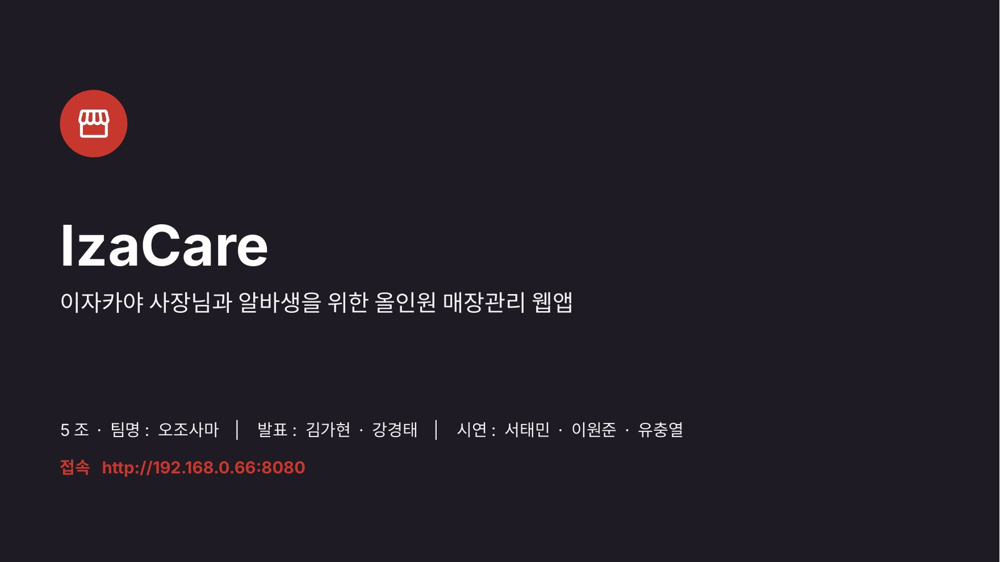

# 🎤 IzaCare 최종 발표 자료

**이자카야 사장님과 알바생을 위한 올인원 매장관리 웹앱**

[**📄 PDF로 보기**](original/05_발표자료.pdf) &nbsp;·&nbsp; [**⬇️ PPTX 받기**](original/05_발표자료.pptx) &nbsp;·&nbsp; [**📁 문서 목록**](README.md)

---

## 발표 정보

| 항목 | 내용 |
|---|---|
| 팀 | 5조 · 오조사마 |
| 발표 | 김가현 · 강경태 |
| 시연 | 서태민 (출근·공지·일보) → 이원준 (재고·AI 실사) → 유충열 (예약·좌석 맵) |
| 구성 | 기획 배경 → 핵심 기능 → 설계 & 구조 → 라이브 시연 → 마무리 & Q&A |

> [!NOTE]
> 슬라이드에 나오는 `http://192.168.0.66:8080`, Wi-Fi `DSA`, 가게 코드 `DEMO01`은 **발표 당일 현장 네트워크용** 시연 정보입니다. 지금은 접속할 수 없고, 직접 실행하려면 [프로젝트 README › 빠른 시작](../README.md)을 참고하세요.

## 한눈에 보기

<table>
<tr>
<td align="center" width="33%"> <b>01</b> 표지</td>
<td align="center" width="33%"><a href="#s02">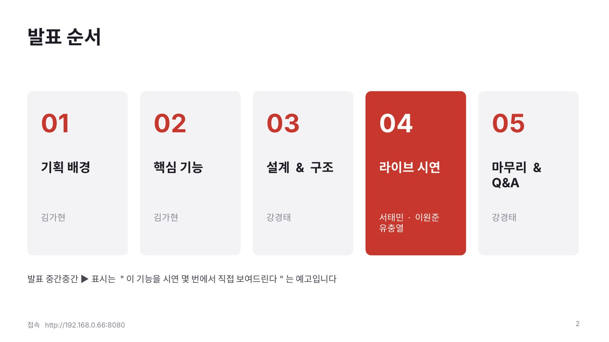</a> <b>02</b> 발표 순서</td>
<td align="center" width="33%"><a href="#s03">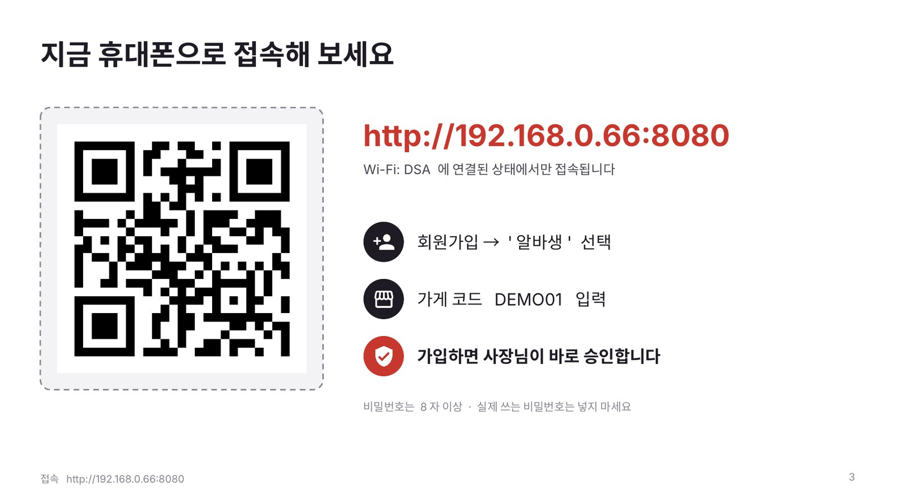</a> <b>03</b> 휴대폰으로 접속</td>
</tr>
<tr>
<td align="center"><a href="#s04">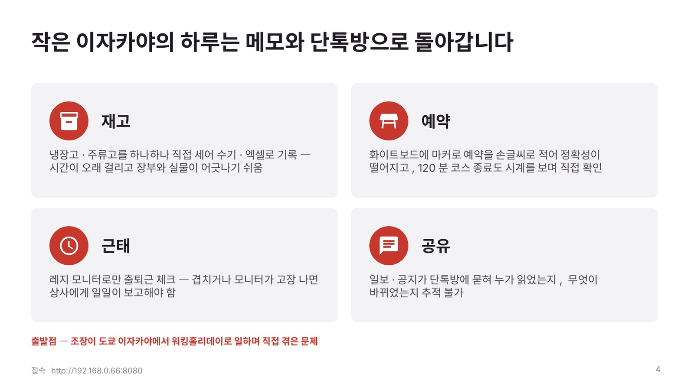</a> <b>04</b> 기획 배경</td>
<td align="center"><a href="#s05">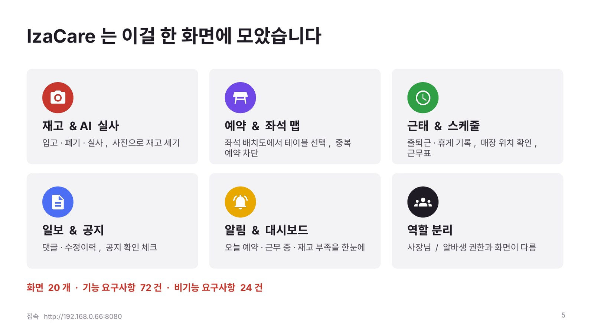</a> <b>05</b> 기능 한눈에</td>
<td align="center"><a href="#s06">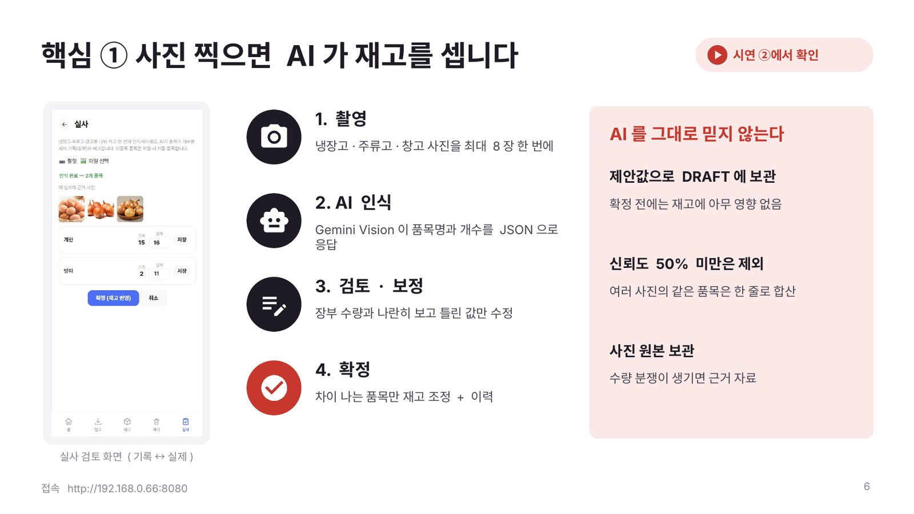</a> <b>06</b> 핵심 ① AI 실사</td>
</tr>
<tr>
<td align="center"><a href="#s07">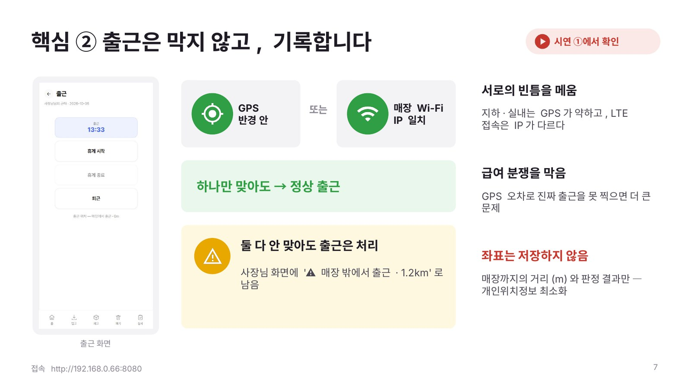</a> <b>07</b> 핵심 ② 출근 위치</td>
<td align="center"><a href="#s08">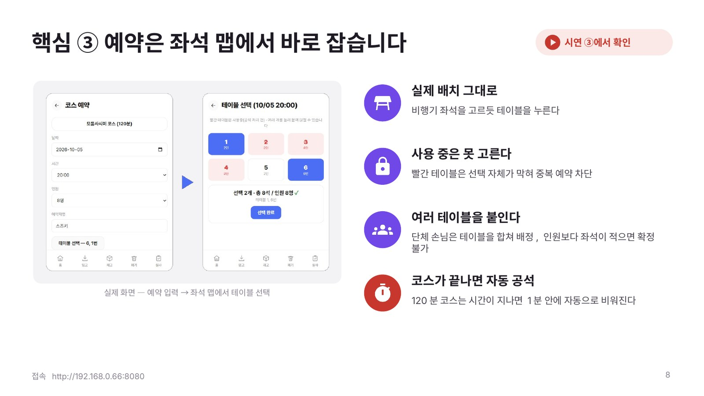</a> <b>08</b> 핵심 ③ 좌석 맵 예약</td>
<td align="center"><a href="#s09">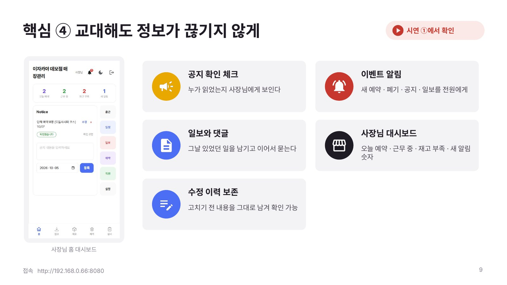</a> <b>09</b> 핵심 ④ 인수인계</td>
</tr>
<tr>
<td align="center"><a href="#s10">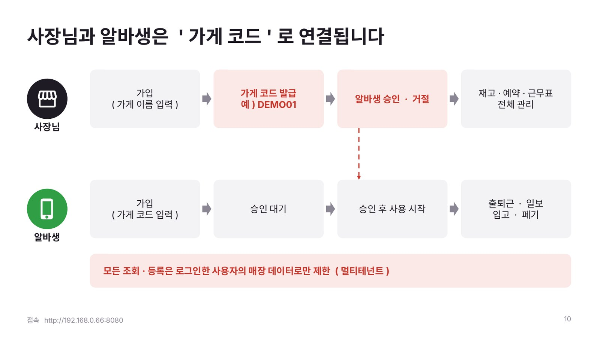</a> <b>10</b> 가게 코드</td>
<td align="center"><a href="#s11">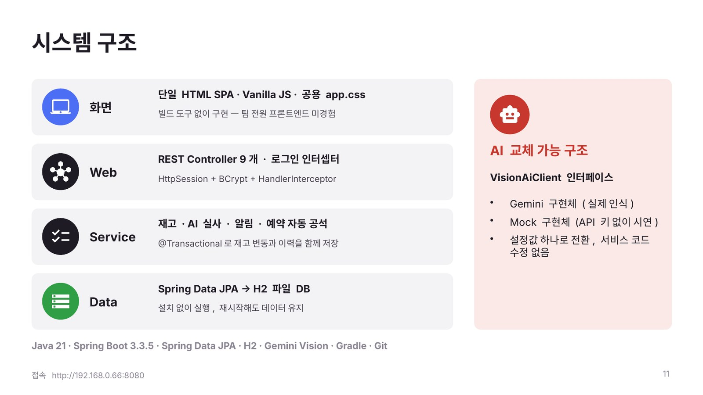</a> <b>11</b> 시스템 구조</td>
<td align="center"><a href="#s12">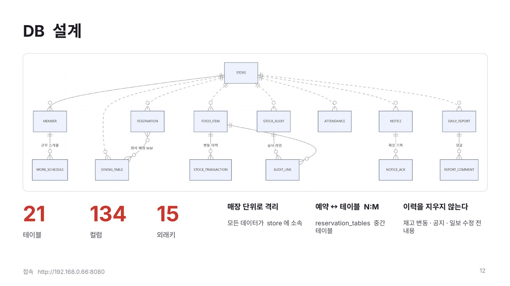</a> <b>12</b> DB 설계</td>
</tr>
<tr>
<td align="center"><a href="#s13">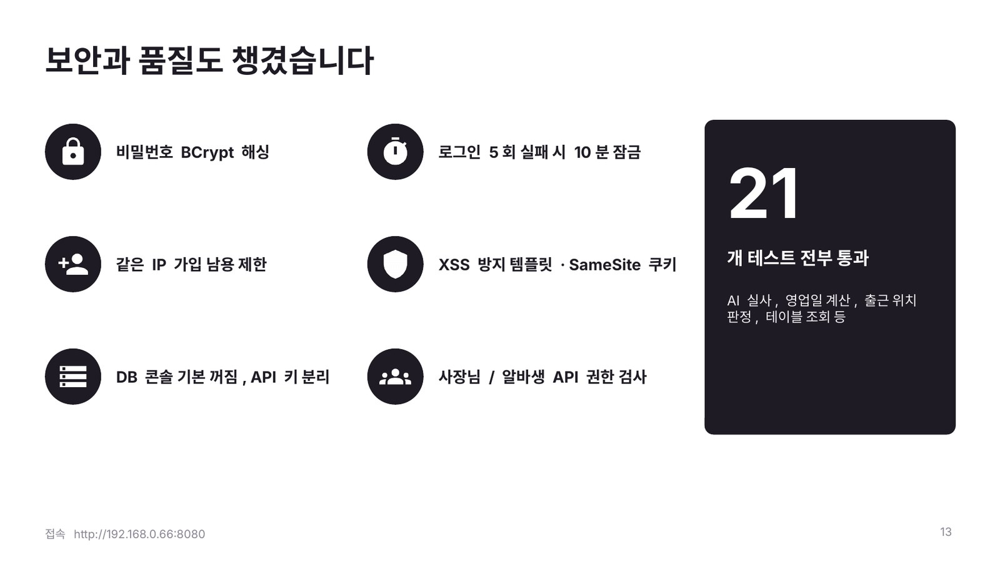</a> <b>13</b> 보안과 품질</td>
<td align="center"><a href="#s14">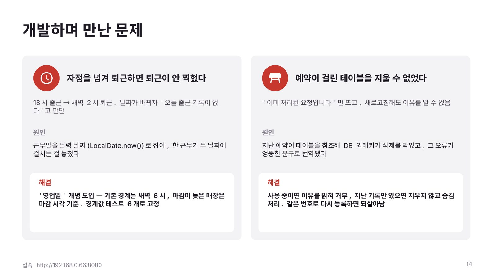</a> <b>14</b> 개발하며 만난 문제</td>
<td align="center"><a href="#s15">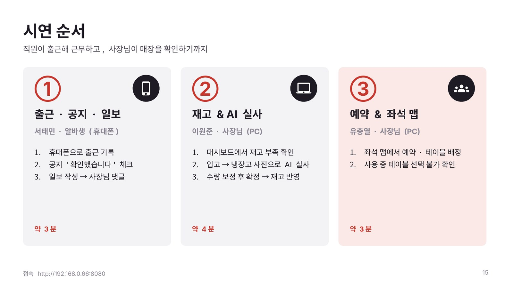</a> <b>15</b> 시연 순서</td>
</tr>
<tr>
<td align="center"> <b>16</b> LIVE DEMO</td>
<td align="center"><a href="#s17">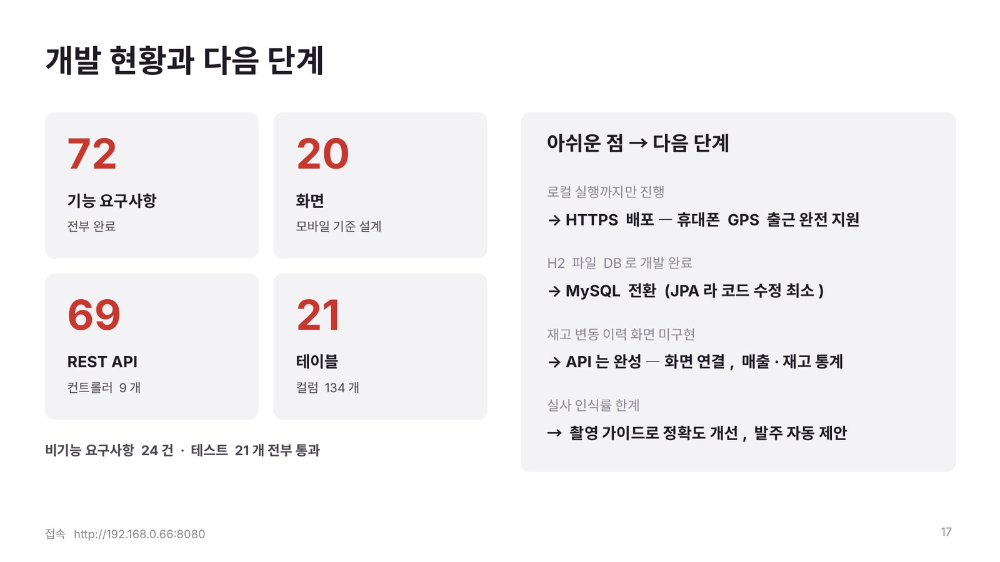</a> <b>17</b> 현황과 다음 단계</td>
<td align="center"><a href="#s18">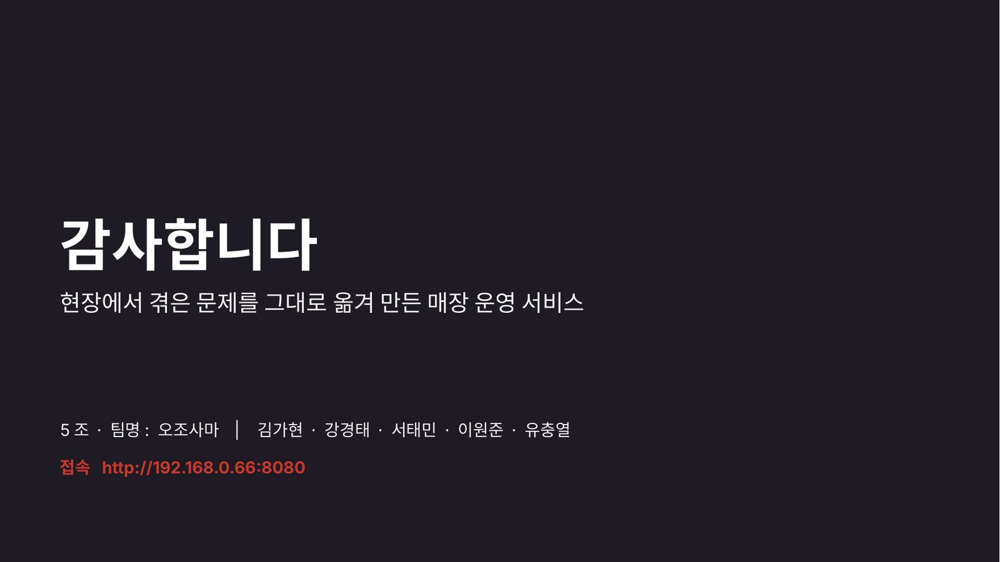</a> <b>18</b> 감사합니다</td>
</tr>
</table>

---

## 🟥 Opening

### 01 · IzaCare

### 02 · 발표 순서

> 기획 배경·핵심 기능(김가현) → 설계 & 구조(강경태) → 라이브 시연(서태민·이원준·유충열) → 마무리 & Q&A(강경태). 슬라이드의 ▶ 표시는 해당 기능을 시연 몇 번에서 보여 주는지 알려 줍니다.

### 03 · 지금 휴대폰으로 접속해 보세요

> 청중이 QR로 접속해 알바생으로 가입하고, 가게 코드 `DEMO01`을 입력하면 사장님이 바로 승인하는 참여형 오프닝.

<a href="#한눈에-보기">↑ 목록으로</a>

## 🟥 01 기획 배경

### 04 · 작은 이자카야의 하루는 메모와 단톡방으로 돌아갑니다

> **재고**는 손으로 세서 엑셀에, **예약**은 화이트보드에, **근태**는 레지 모니터에, **공유**는 단톡방에. 조장이 도쿄 이자카야 워킹홀리데이에서 직접 겪은 문제에서 출발했습니다. → [기획서](01-기획서.md)

### 05 · IzaCare는 이걸 한 화면에 모았습니다

> 재고 & AI 실사 · 예약 & 좌석 맵 · 근태 & 스케줄 · 일보 & 공지 · 알림 & 대시보드 · 사장님/알바생 역할 분리. → [요구사항 정의서](02-요구사항정의서.md)

<a href="#한눈에-보기">↑ 목록으로</a>

## 🟥 02 핵심 기능

### 06 · 핵심 ① 사진 찍으면 AI가 재고를 셉니다 ▶ 시연 ②

> **촬영 → AI 인식 → 검토·보정 → 확정.** AI 결과는 DRAFT 제안값으로만 두고 사람이 확인한 뒤 차이 나는 품목만 조정합니다. 신뢰도 50% 미만은 제외하고, 사진 원본은 근거로 보관합니다.

### 07 · 핵심 ② 출근은 막지 않고, 기록합니다 ▶ 시연 ①

> GPS 반경 **또는** 매장 Wi-Fi IP 중 하나만 맞으면 정상 출근. 둘 다 안 맞아도 출근은 처리하고 `⚠ 매장 밖에서 출근 · 1.2km`로 기록합니다. 좌표는 저장하지 않고 거리와 판정 결과만 남깁니다.

### 08 · 핵심 ③ 예약은 좌석 맵에서 바로 잡습니다 ▶ 시연 ③

> 실제 매장 배치 그대로 테이블을 고르고, 사용 중인 테이블은 선택 자체를 막아 중복 예약을 차단합니다. 단체는 여러 테이블을 붙여 배정하고, 코스 시간이 끝나면 1분 안에 자동 공석 처리.

### 09 · 핵심 ④ 교대해도 정보가 끊기지 않게 ▶ 시연 ①

> 공지 확인 체크 · 일보와 댓글 · 수정 이력 보존 · 이벤트 알림 · 사장님 대시보드.

<a href="#한눈에-보기">↑ 목록으로</a>

## 🟥 03 설계 & 구조

### 10 · 사장님과 알바생은 '가게 코드'로 연결됩니다

> 사장님 가입 시 가게 코드 발급 → 알바생은 코드로 가입 → 사장님 승인. 모든 조회·등록은 로그인한 사용자의 매장 데이터로만 제한됩니다 (멀티테넌트).

### 11 · 시스템 구조

> 화면(Vanilla JS SPA) → Web(REST Controller · 로그인 인터셉터) → Service(@Transactional) → Data(Spring Data JPA · H2). AI는 `VisionAiClient` 인터페이스 뒤에 Gemini / Mock 구현체를 둬 교체할 수 있습니다.

### 12 · DB 설계

> 테이블 21개 · 컬럼 134개 · 외래키 15개. 모든 데이터는 `store`에 소속되고, 예약↔테이블은 N:M, 이력은 지우지 않습니다. → [ERD & 테이블 정의서](04-ERD-테이블정의서.md)

### 13 · 보안과 품질도 챙겼습니다

> BCrypt 해싱 · 로그인 5회 실패 시 10분 잠금 · 같은 IP 가입 남용 제한 · XSS 방지 템플릿 · SameSite 쿠키 · 역할별 API 권한 검사 · 테스트 21개 전부 통과.

### 14 · 개발하며 만난 문제

> **자정 넘긴 퇴근이 안 찍힘** → '영업일' 개념 도입(기본 경계 새벽 6시) + 경계값 테스트. **예약이 걸린 테이블 삭제 불가** → 사용 중이면 이유를 밝혀 거부하고, 지난 예약만 있으면 숨김 처리.

<a href="#한눈에-보기">↑ 목록으로</a>

## 🟥 04 라이브 시연

### 15 · 시연 순서

| 순서 | 시연자 · 역할 | 내용 | 시간 |
|:-:|---|---|:-:|
| ① | 서태민 · 알바생 (휴대폰) | 출근 기록 → 공지 확인 → 일보 작성 → 사장님 댓글 | 약 3분 |
| ② | 이원준 · 사장님 (PC) | 재고 부족 확인 → 입고 → 냉장고 사진으로 AI 실사 → 보정 후 확정 | 약 4분 |
| ③ | 유충열 · 사장님 (PC) | 좌석 맵에서 예약·테이블 배정 → 사용 중 테이블 선택 불가 확인 | 약 3분 |

### 16 · LIVE DEMO

<a href="#한눈에-보기">↑ 목록으로</a>

## 🟥 05 마무리 & Q&A

### 17 · 개발 현황과 다음 단계

| 아쉬운 점 | 다음 단계 |
|---|---|
| 로컬 실행까지만 진행 | HTTPS 배포 — 휴대폰 GPS 출근 완전 지원 |
| H2 파일 DB로 개발 | MySQL 전환 (JPA라 코드 수정 최소) |
| 재고 변동 이력 화면 미구현 | API는 완성 — 화면 연결, 매출·재고 통계 |
| 실사 인식률 한계 | 촬영 가이드로 정확도 개선, 발주 자동 제안 |

### 18 · 감사합니다

---

**현장에서 겪은 문제를 그대로 옮겨 만든 매장 운영 서비스**

5조 오조사마 · 김가현 · 강경태 · 서태민 · 이원준 · 유충열

[← 문서 목록](README.md) &nbsp;·&nbsp; [프로젝트 README](../README.md) &nbsp;·&nbsp; [↑ 맨 위로](#-izacare-최종-발표-자료)

